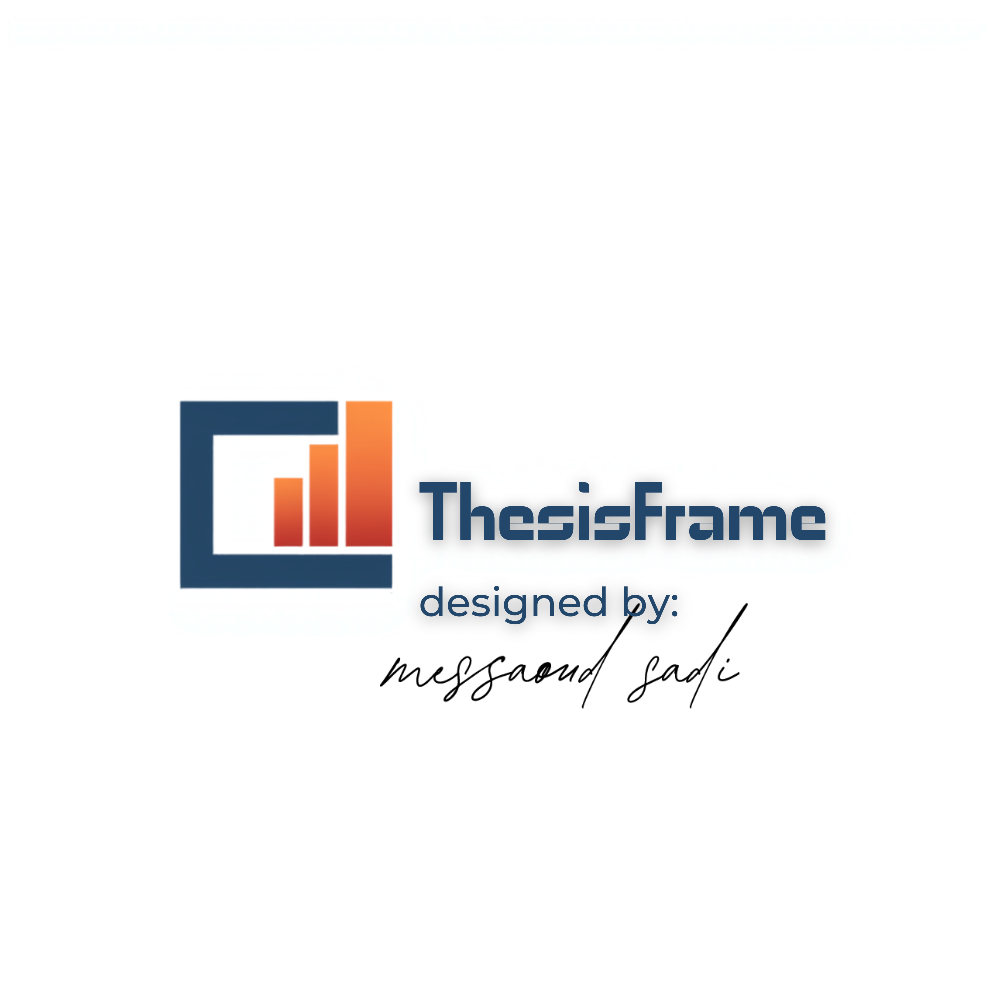

<div align="center">



# ThesisFrame

**L'assistant complet pour la rédaction de thèses de doctorat**

[](https://nextjs.org/)
[](https://www.typescriptlang.org/)
[](https://tailwindcss.com/)
[](https://ui.shadcn.com/)
[](https://www.prisma.io/)

</div>

---

## Présentation

**ThesisFrame** est une application web de type *« tout-en-un »* conçue pour accompagner les doctorants tout au long de leur parcours de thèse. Elle combine méthodologie de recherche, rédaction scientifique assistée par IA, gestion de références bibliographiques, visualisation de données et préparation à la soutenance.

Conçue initialement pour les doctorants en **architecture, urbanisme et aménagement**, ses outils sont transverses et utilisables dans toutes les disciplines.

---

## Fonctionnalités

### 1. Assistant IA — 10 modes d'écriture spécialisés

Un assistant conversationnel propulsé par IA, avec des system prompts experts pour chaque usage :

| Mode | Description |
|------|-------------|
| Rédaction scientifique | Structure IMRaD, prose académique, style formel |
| Revue de littérature | Synthèse, identification de lacunes, organisation thématique |
| Relecture critique | Peer review, évaluation méthodologique, retours constructifs |
| Paraphrase & Amélioration | Reformulation, enrichissement du vocabulaire, correction de style |
| Résumé & Abstract | Résumés structurés, mots-clés, abstracts bilingues |
| Génération d'hypothèses | Hypothèses testables, identification des variables, prédictions |
| Positionnement méthodologique | Justification du design de recherche à partir de la littérature |
| Construction théorique | Cadres conceptuels à partir de la littérature |
| Document de supervision | Plan de travail personnalisé, calendrier, jalons (itératif) |
| Présentation & Soutenance | Plan de slides, scripts, gestion du jury, framework SUCCESs |

### 2. Méthodologie de la recherche — 7 sous-onglets

- **Démarche** — Cycle de la recherche, types de recherche, induction/déduction, disciplinarités, **les 3 Piliers** (Michel Baud)
- **Problématique** — Guide de formulation, **3 niveaux de problématique**, **sujets à éviter**, **plan de travail vs plan de rédaction**, générateur de titre, vérificateur d'hypothèses
- **Variables** — Types et opérationalisation
- **Outils de collecte** — Comparateur Questionnaire vs Sondage, grille d'observation interactive
- **Documentation** — Types de documents, bases de données, catalogues, ressources web
- **Concepts** — Triangle d'Ogden & Richards, guide de formalisation
- **Aptitude** — **Test interactif d'aptitude au doctorat** (10 questions, 3 niveaux d'interprétation)

### 3. Articles scientifiques — 7 sous-onglets

- **Étapes** — Les 8 étapes de la rédaction d'un article
- **Sections IMRaD** — Guide détaillé Introduction / Méthodes / Résultats / Discussion
- **Erreurs** — Erreurs fréquentes à éviter
- **Checklist** — Liste de vérification avant soumission
- **Boîte à outils** — 6 étapes et 25+ outils numériques pour la revue de littérature
- **Guide revue** — Guide complet en 5 phases de la revue systématique
- **Soutenance** — **Guide complet de la soutenance orale** (plan type, règles supports, gestion du jury, préparation psychologique)

### 4. Références bibliographiques

- Gestion locale CRUD de références (SQLite / Prisma)
- Connexion Mendeley (OAuth 2.0 + token manuel)
- Import depuis Mendeley avec déduplication
- Export BibTeX téléchargeable
- Recherche et filtrage

### 5. Plan de thèse

- Générateur de modèle LaTeX complet
- Structure standard de thèse (couverture, remerciements, sommaire, introduction, chapitres, conclusion, bibliographie, annexes)
- Personnalisation du titre, auteur, directeur, établissement, date
- Téléchargement du fichier `.tex`

### 6. Outils IA — 4 sous-onglets

- **Humanizer** — Reformulation en prose naturelle
- **Consensus** — Analyse multi-sources avec synthèse
- **Carnet de recherche** — Notes, sources, Q&A avec IA, **graphe de connaissances** interactif (force-directed SVG, 5 catégories, 5 types de relations)
- **Visualisation** — 6 types de graphiques SVG (barres, lignes, circulaire, nuage de points, aire, radar), 4 palettes, édition de données, export SVG

### 7. Bases de données académiques — 7 ressources

| Base | Spécialité |
|------|------------|
| [Welib](https://welib.st/) | 700K+ livres numérisés |
| [Anna's Archive](https://annas-archive.org/) | 18M+ livres et documents |
| [Library Genesis](https://libgen.im/) | Ouvrages et articles en accès libre |
| [LibGuides](https://libguides.library.arizona.edu/ai-researchers/scispace/) | Outils et guides IA pour chercheurs |
| [ShadowLibraries](https://shadowlibraries.github.io/) | Bibliothèques et ressources numériques |
| [HAL Science](https://hal.science/) | Archive ouverte française |
| [Elsevier JournalFinder](https://journalfinder.elsevier.com/) | Trouver la revue idéale pour publier |

---

## Stack technique

| Catégorie | Technologie |
-----------|-------------|
| Framework | Next.js 16 (App Router) |
| Langage | TypeScript 5 |
| UI | Tailwind CSS 4 + shadcn/ui (New York) |
| Icônes | Lucide React |
| Base de données | SQLite via Prisma ORM |
| IA | z-ai-web-dev-sdk (LLM intégré, gratuit) |
| State management | Zustand + React hooks |
| Formulaires | React Hook Form + Zod |
| Éditeur texte | MDXEditor |
| Drag & Drop | dnd-kit |

---

## Structure du projet

```
thesisframe/
├── src/
│   ├── app/
│   │   ├── page.tsx              # Composant principal (onglets, panneaux, outils)
│   │   ├── layout.tsx            # Layout racine
│   │   └── api/
│   │       ├── ai-writing/       # Assistant IA (10 modes, conversation)
│   │       ├── references/       # CRUD références + BibTeX
│   │       ├── mendeley/         # Connexion OAuth Mendeley
│   │       ├── notebook/         # Carnet de recherche + Q&A
│   │       ├── knowledge-graph/  # Graphe de connaissances
│   │       ├── generate-latex/   # Génération template LaTeX
│   │       ├── humanizer/        # Text humanizer
│   │       ├── consensus/        # Analyse multi-sources
│   │       └── academy-db/       # Bases de données académiques
│   ├── components/ui/            # Composants shadcn/ui
│   ├── data/
│   │   ├── methodology-guide.ts # Données méthodologiques (830 lignes)
│   │   ├── articles-guide.ts    # Guide de rédaction d'articles
│   │   └── latex-template.ts    # Template LaTeX de thèse
│   └── lib/
│       └── db.ts                 # Client Prisma
├── prisma/
│   └── schema.prisma            # 8 modèles (User, Post, Reference, MendeleyConfig, etc.)
├── db/                          # Base SQLite
└── package.json
```

---

## Références académiques intégrées

Les contenus et system prompts s'appuient sur :

- Michel Baud, *L'Art de la Thèse*, La Découverte (202p.)
- Buttler, *Conseils de rédaction du mémoire et de la soutenance orale*
- Cours IGTU-Cne3, *Méthodologie d'élaboration d'une thèse de Doctorat*
- Garr Reynolds, *Presentation Zen* (2008)
- Carmine Gallo, *Talk Like TED* (2014)
- Chip Heath & Dan Heath, *Made to Stick* (2007)
- Umberto Eco, *Comment on rédige une thèse* (2015)
- Booth, Colomb & Williams, *The Craft of Research* (2008)
- Inger Mewburn, *How to Tame Your PhD* (2013)

---

## Installation

```bash
# Cloner le dépôt
git clone https://github.com/freemind25/these-frame.git
cd these-frame

# Installer les dépendances
bun install

# Initialiser la base de données
bun run db:push

# Lancer le serveur de développement
bun run dev
```

L'application est accessible sur `http://localhost:3000`.

---

## Scripts

| Commande | Description |
|----------|-------------|
| `bun run dev` | Serveur de développement (port 3000) |
| `bun run lint` | Vérification ESLint |
| `bun run db:push` | Synchroniser le schéma Prisma avec la base |
| `bun run db:studio` | Ouvrir Prisma Studio |

---

## Auteur

**Freemind25** — [GitHub](https://github.com/freemind25)

---

## Licence

Ce projet est fourni à des fins éducatives et de recherche. Contactez l'auteur pour toute question d'utilisation.
