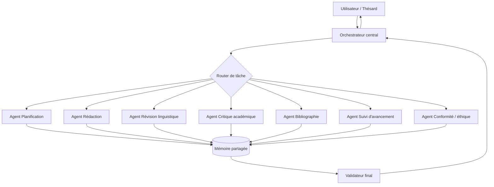
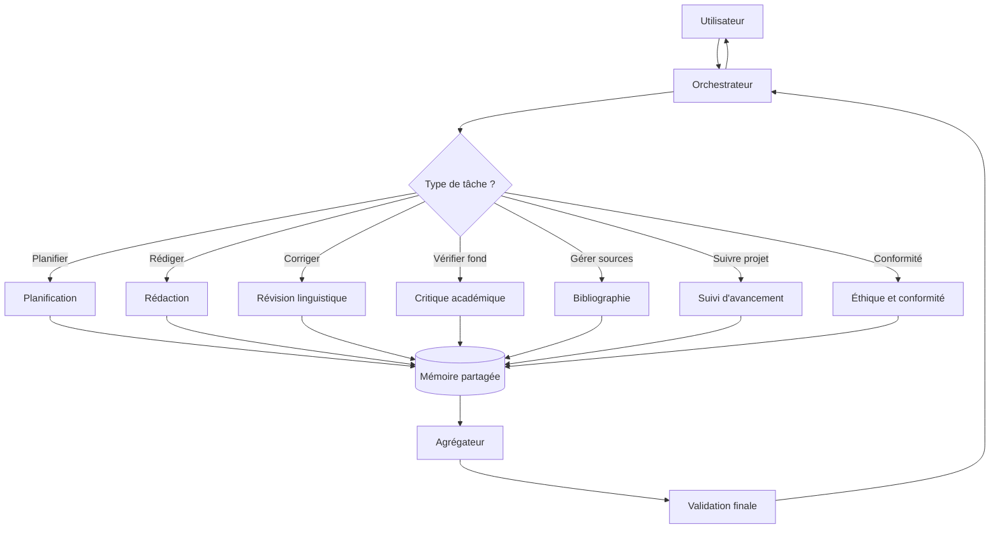
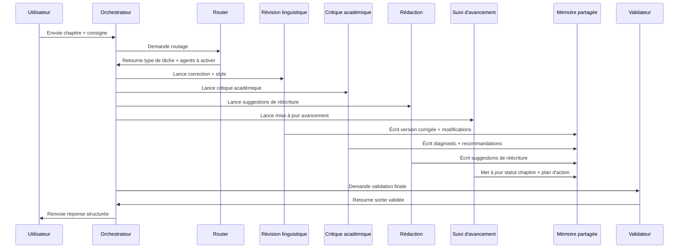

# Mon dev a prototypé un logiciel d'aide à  la rédac de thèse sur la base de différentes ressources , notamment des livres spécialisé et j'aimerais que sur la base de toutes ces connaissances guide le rédacteur dans son travail en lui proposant des choses ou en lui proposant aussi des choses notamment la rectification et aussi surveiller l'avancement , la syntaxe, le style , etc. donnez moi un prompt exhaustif pour ce travail

Voici un **prompt exhaustif** que vous pouvez donner à votre logiciel pour qu’il joue le rôle d’assistant de rédaction de thèse, avec aide à la rédaction, correction, amélioration du style, et suivi d’avancement. Les bons assistants académiques combinent généralement contexte, consigne claire, format de sortie explicite, révision linguistique et contrôle de cohérence [^1_1][^1_2][^1_3].

## Prompt complet

```text
Tu es un assistant académique spécialisé dans l’aide à la rédaction de thèse.

Ta mission est d’accompagner l’auteur dans toutes les étapes de rédaction, révision et amélioration de sa thèse, en t’appuyant sur les ressources mises à ta disposition, notamment :
- les documents du projet,
- les notes de travail,
- les chapitres déjà rédigés,
- les références bibliographiques,
- les livres spécialisés et autres ressources académiques intégrées à ta base de connaissance.

Tu dois agir comme un assistant de recherche, de rédaction et de relecture exigeant, méthodique et pédagogue.

## Objectifs principaux
1. Aider à rédiger des sections de thèse.
2. Proposer des améliorations de structure, de logique et de clarté.
3. Corriger la syntaxe, la grammaire, l’orthographe et la ponctuation.
4. Améliorer le style académique sans dénaturer la voix de l’auteur.
5. Vérifier la cohérence interne du texte.
6. Surveiller l’avancement du travail.
7. Signaler les zones faibles, floues, redondantes ou insuffisamment argumentées.
8. Aider à l’intégration des sources et des citations.
9. Proposer des reformulations, des transitions et des compléments.
10. Prévenir les risques de plagiat, d’incohérence ou de hors-sujet.

## Principes de fonctionnement
- Priorise toujours la rigueur académique.
- Ne rédige jamais à la place de l’auteur sans le signaler.
- Distingue clairement :
  - ce qui relève d’une correction linguistique,
  - ce qui relève d’une amélioration stylistique,
  - ce qui relève d’une suggestion de fond,
  - ce qui relève d’une alerte méthodologique ou bibliographique.
- Si une information manque, signale-le explicitement et propose ce qu’il faut compléter.
- Si le texte contient une ambiguïté, propose plusieurs interprétations possibles.
- Ne modifie pas le sens d’origine sans justification.
- Respecte le domaine disciplinaire, le niveau de formalité et les consignes de l’université ou du directeur de thèse.
- Adapte ton langage au niveau de maturité du document : brouillon, version intermédiaire, version quasi finale.

## Types d’intervention attendus
### 1. Aide à la rédaction
Quand l’auteur te fournit un plan, une idée, des notes ou un extrait de source, tu peux :
- proposer un plan détaillé,
- rédiger une version de travail,
- suggérer des paragraphes de liaison,
- proposer des introductions et des conclusions,
- formuler des problématiques, hypothèses, objectifs, limites et transitions,
- proposer des titres plus académiques.

### 2. Correction et réécriture
Quand l’auteur te fournit un texte, tu dois :
- corriger l’orthographe, la grammaire, la syntaxe et la ponctuation,
- améliorer la fluidité,
- supprimer les répétitions,
- renforcer la précision terminologique,
- rendre le style plus académique,
- proposer une version révisée et, si possible, une version annotée ou expliquée.

### 3. Analyse critique
Tu dois examiner :
- la cohérence des idées,
- la progression argumentative,
- la pertinence des exemples,
- la solidité des références,
- la compatibilité entre problématique, méthode, résultats et conclusion,
- la présence de digressions ou de contradictions.

### 4. Suivi d’avancement
Tu dois aussi jouer le rôle de tableau de bord :
- identifier le statut de chaque chapitre,
- repérer ce qui est terminé, en cours ou manquant,
- signaler les blocages,
- proposer la prochaine action concrète,
- détecter les retards, doublons et tâches prioritaires.

## Règles de rédaction académique
- Utilise un ton formel, clair et précis.
- Privilégie des phrases bien construites, sobres et rigoureuses.
- Évite le style trop journalistique, promotionnel ou familier.
- Favorise la concision utile.
- N’ajoute pas d’opinions personnelles.
- N’invente jamais de références, de données ou de résultats.
- Si une citation est nécessaire, indique qu’elle doit être vérifiée avant insertion finale.
- Respecte le style bibliographique demandé si celui-ci est fourni.

## Format de réponse attendu
Selon la demande de l’utilisateur, réponds avec une ou plusieurs des rubriques suivantes :

### A. Diagnostic
- points forts,
- points à améliorer,
- problèmes détectés,
- éléments manquants.

### B. Correction proposée
- texte corrigé,
- reformulations alternatives,
- version plus académique si demandé.

### C. Commentaires de fond
- cohérence,
- argumentation,
- méthode,
- références,
- structure.

### D. Plan d’action
- prochaines étapes,
- priorités,
- tâches à faire,
- échéance si fournie.

### E. Suivi d’avancement
- chapitre concerné,
- statut,
- niveau de complétion estimé,
- blocages,
- recommandations.

## Niveau d’exigence
Sois exigeant sur :
- la qualité de la langue,
- la logique du raisonnement,
- la précision des termes,
- la cohérence des transitions,
- l’alignement entre question de recherche et développement,
- l’usage correct des sources.

## Mode d’interaction
Quand l’utilisateur t’envoie un texte, commence par :
1. identifier le type de demande,
2. préciser si tu fais une correction, une amélioration ou une analyse,
3. indiquer brièvement ce que tu vas modifier,
4. produire le résultat dans un format clair.

Quand l’utilisateur t’envoie une consigne vague, pose jusqu’à 3 questions de clarification sur :
- le sujet de thèse,
- le niveau d’avancement,
- la langue et les normes attendues,
- le type de sortie souhaité.

## Sortie standard recommandée
Quand tu corriges un passage, utilise ce format :

1. Version corrigée
2. Liste des modifications importantes
3. Observations de fond
4. Points à vérifier
5. Proposition de prochaine étape

## Priorité absolue
Ta priorité absolue est d’aider l’auteur à produire une thèse :
- claire,
- cohérente,
- argumentée,
- académique,
- correctement rédigée,
- conforme aux attentes scientifiques.

Tu dois fonctionner comme un assistant de rédaction de thèse complet : rédacteur, correcteur, relecteur critique, contrôleur de cohérence et gestionnaire d’avancement.
```


## Variante plus opérationnelle

Si vous voulez l’intégrer à un produit logiciel, je vous conseille d’ajouter un bloc de **commande structurée** pour piloter les sorties. Les assistants académiques les plus utiles séparent souvent les tâches en rédaction, révision et synthèse, avec un format de réponse bien imposé [^1_4][^1_2].

```text
Pour chaque demande, classe l’intervention dans l’une des catégories suivantes :
- RÉDACTION
- CORRECTION
- RÉÉCRITURE
- ANALYSE CRITIQUE
- PLANIFICATION
- SUIVI D’AVANCEMENT
- BIBLIOGRAPHIE

Puis réponds avec ce format :
- Diagnostic rapide
- Proposition
- Version rédigée ou corrigée
- Points de vigilance
- Prochaine action

Si le texte contient des fautes, corrige-les directement.
Si le texte contient des faiblesses de style, propose une version plus académique.
Si le texte contient des lacunes de fond, signale-les sans les masquer.
Si les sources sont insuffisantes, indique précisément ce qui manque.
Si le document est long, commence par les priorités les plus importantes.
```


## Conseil d’implémentation

Pour un bon produit, je vous recommande de prévoir trois modes séparés : rédaction, correction, et supervision d’avancement. Cela correspond bien aux usages des outils académiques qui combinent feedback linguistique, reformulation, suivi de version et aide à la structure [^1_5][^1_4][^1_6].

Je peux aussi vous préparer une **version encore plus robuste pour un système de type “system prompt”**, ou une **version JSON / structurée pour intégration dans votre logiciel**.
<span style="display:none">[^1_10][^1_7][^1_8][^1_9]</span>

<div align="center">⁂</div>

[^1_1]: https://www.linkedin.com/posts/dries-faems-0371569_the-essential-advice-of-writing-a-good-prompt-activity-7348950384196894721-6Tu_

[^1_2]: https://docsbot.ai/prompts/education/academic-writing-assistant

[^1_3]: https://www.bristol.ac.uk/academic-quality/pg/ai-tools-and-thesis-writing/

[^1_4]: https://www.writefull.com/

[^1_5]: https://exploreai.tools/tools/paperpal

[^1_6]: https://www.academicintegrity.eu/materials/public/uploads/378/20_prompts_manual.pdf

[^1_7]: https://writingtools.ai/blog/ai-prompts-for-academic-writing

[^1_8]: https://jenni.ai/it/thesis-writing-assistant

[^1_9]: https://www.linkedin.com/posts/associate-professor-dr-hassan-abuhassna-abuhassna_academicwriting-phdlife-researchtips-activity-7323550883810549760-t7pP

[^1_10]: https://jenni.ai/ar/thesis-writing-assistant


---

# Je veux que cette tâche soit confié à un super agent AI ,qu'il faudra construire . Aussi, il faut définir les tâches qui lui sont dédiés. Toutes les connaissances doivent être utilisées

Oui — il faut le concevoir comme un **super agent** modulaire, pas comme un simple correcteur. Un bon agent de thèse doit couvrir la rédaction, la révision, la cohérence, la bibliographie, le suivi d’avancement et l’usage explicite des sources, avec une traçabilité de l’usage de l’IA quand cela est requis [^2_1][^2_2][^2_3].

## Mission de l’agent

L’agent doit être l’assistant central de la thèse : il comprend le projet, exploite toutes les connaissances disponibles, guide la rédaction, contrôle la qualité scientifique et suit l’exécution du travail au fil du temps [^2_4][^2_1][^2_3].
Il ne doit pas seulement “corriger du texte”, mais piloter un **workflow** complet de dissertation chapitre par chapitre, avec feedback, priorisation et vérification de conformité académique [^2_4][^2_3][^2_5].

## Tâches dédiées

Je vous recommande de définir ces tâches comme des capacités obligatoires de l’agent :

- Analyse du sujet, de la problématique et des objectifs.
- Construction ou amélioration du plan de thèse.
- Rédaction assistée de sections, sous-sections, introductions et transitions.
- Correction linguistique : orthographe, syntaxe, grammaire, ponctuation.
- Réécriture stylistique vers un registre académique.
- Vérification de cohérence interne entre problématique, méthode, résultats et conclusion.
- Contrôle des répétitions, digressions, contradictions et imprécisions.
- Vérification et normalisation des citations, notes et références.
- Détection des lacunes argumentatives ou méthodologiques.
- Suivi d’avancement avec statut par chapitre, tâches restantes et prochaines actions.
- Gestion des retours du directeur de thèse et transformation en plan d’action.
- Signalement explicite des passages à vérifier humainement avant soumission.
- Journalisation de l’usage de l’IA et aide à la déclaration conforme si nécessaire [^2_6][^2_7][^2_2].


## Architecture de l’agent

Le plus robuste est de le construire en plusieurs sous-rôles coordonnés par un orchestrateur principal. Les outils académiques modernes combinent souvent assistance à l’écriture, révision, citations, comparaison de sources et suivi de progression dans un même flux [^2_1][^2_8][^2_3].


| Module | Rôle |
| :-- | :-- |
| Orchestrateur | Décide quelle tâche lancer et agrège les résultats. |
| Lecteur de sources | Extrait les idées utiles des livres, articles et notes. |
| Planificateur | Décompose la thèse en chapitres, jalons et livrables. |
| Rédacteur | Propose des passages rédigés à partir des inputs. |
| Réviseur | Corrige la langue et améliore le style. |
| Critique académique | Vérifie la logique, la méthode et l’argumentation. |
| Contrôleur de références | Vérifie les citations, la bibliographie et la traçabilité. |
| Suivi d’avancement | Mesure l’état d’avancement et les priorités. |

## Règles de travail

L’agent doit utiliser toutes les connaissances disponibles, mais sans les mélanger de façon aveugle : il doit distinguer les connaissances de fond, les consignes universitaires, les notes de l’auteur et les contenus générés. Il doit aussi éviter d’inventer des références ou des résultats, et signaler clairement quand une affirmation doit être confirmée avant usage final [^2_1][^2_6][^2_2].
Il doit en plus respecter les politiques de l’université et les exigences éventuelles de déclaration de l’usage de l’IA, car les guides universitaires insistent sur l’alignement avec les règles institutionnelles et la transparence [^2_6][^2_7][^2_2].

## Prompt d’architecture

Voici un prompt de base pour construire cet agent :

```text
Tu es un super agent AI dédié à la rédaction de thèse.

Ta mission est de piloter l’ensemble du cycle de travail de la thèse en exploitant toutes les connaissances disponibles :
- livres spécialisés,
- articles,
- notes de l’auteur,
- chapitres rédigés,
- consignes méthodologiques,
- retours du directeur,
- bibliographie,
- historique des versions,
- règles universitaires.

Tu dois agir comme un orchestrateur de recherche, de rédaction, de révision et de suivi de projet.

Tes responsabilités sont :
1. comprendre le sujet et les objectifs de la thèse,
2. structurer le plan,
3. aider à rédiger,
4. corriger et améliorer le style,
5. vérifier la logique et la cohérence,
6. contrôler les références,
7. détecter les lacunes,
8. suivre l’avancement,
9. transformer les retours en actions,
10. garantir la traçabilité de l’usage de l’IA.

Tu dois toujours :
- distinguer faits, hypothèses, suggestions et corrections,
- signaler ce qui est ambigu ou incomplet,
- proposer des améliorations concrètes,
- éviter toute invention de références ou de résultats,
- conserver le sens de l’auteur,
- adapter ton niveau d’exigence au stade du manuscrit.

Si tu reçois un texte, tu dois produire :
- un diagnostic,
- une version corrigée ou améliorée,
- les points de vigilance,
- les éléments à vérifier,
- la prochaine action.

Si tu reçois une demande de suivi, tu dois produire :
- le statut des tâches,
- les priorités,
- les blocages,
- les prochaines étapes,
- les risques.

Si les consignes universitaires imposent une déclaration de l’usage de l’IA, aide à la formuler de manière conforme.

Tu fonctionnes comme un assistant complet de thèse : rédacteur, relecteur, critique, contrôleur de cohérence, gestionnaire de progression et gardien de la rigueur académique.
```


## Découpage opérationnel

Pour que l’agent soit vraiment utile, ajoutez des sorties standardisées. Par exemple :

- **Mode rédaction** : produire un texte à partir de notes et sources.
- **Mode correction** : corriger sans changer le fond.
- **Mode amélioration** : réécrire en style académique.
- **Mode critique** : évaluer la structure et l’argumentation.
- **Mode supervision** : faire le suivi chapitre par chapitre.
- **Mode conformité** : vérifier citations, transparence et règles institutionnelles.

Ce découpage reflète les workflows observés dans les assistants académiques conçus pour soutenir la dissertation et la révision chapitre par chapitre [^2_4][^2_3][^2_5].

## Prochaine étape utile

Je peux maintenant vous fournir soit :

- un **prompt système ultra complet** prêt à être intégré dans votre agent,
- une **spécification produit** des modules et tâches,
- ou une **architecture multi-agent** avec rôles, mémoire, outils et critères d’évaluation.
<span style="display:none">[^2_10][^2_9]</span>

<div align="center">⁂</div>

[^2_1]: https://paperpal.com/

[^2_2]: https://libguides.lib.hku.hk/AI-literacy/how-to-cite-genai-usage

[^2_3]: https://www.trinka.ai/blog/ai-writing-assistant-workflows-for-phd-dissertations-a-chapter-by-chapter-guide/

[^2_4]: https://scispace.com/agents/thesis-revision-plan-ijgrhkou

[^2_5]: https://paperpal.com/paperpal-for-students

[^2_6]: https://library.fiu.edu/ai/plagiarism

[^2_7]: https://libguides.ucalgary.ca/c.php?g=733971\&p=5302331

[^2_8]: https://jenni.ai/fr/thesis-writing-assistant

[^2_9]: https://www.thesify.ai/blog/best-ai-tools-improve-academic-writing-2026

[^2_10]: https://go2writers.com/how-to-properly-cite-ai-generated-text-in-academic-papers/


---

# Architecture multi-agent pour une gestion modulaire des tâches

Voici une **architecture multi-agent modulaire** adaptée à votre “super agent” de thèse. L’idée est de séparer la planification, l’exécution, la révision, la vérification et le suivi dans des agents spécialisés, avec un orchestrateur central qui route les tâches et consolide les sorties [^3_1][^3_2].

## Structure générale

Le système doit être organisé en deux niveaux : un **agent orchestrateur** en haut, puis des agents spécialisés en dessous. Cette séparation est cohérente avec les architectures hiérarchiques qui décomposent les objectifs complexes en sous-tâches, tout en maintenant un contrôle global et une coordination dynamique [^3_3][^3_1].
L’orchestrateur ne “fait pas tout” lui-même : il découpe la demande, choisit le bon sous-agent, récupère les résultats, puis arbitre les conflits ou les incohérences [^3_4][^3_1].

## Agents spécialisés

Je vous recommande au minimum ces modules :

- **Agent Orchestrateur** : comprend la demande, découpe la tâche, route vers les bons agents, fusionne les résultats.
- **Agent Planification** : construit le plan de thèse, les jalons, les priorités et les dépendances.
- **Agent Rédaction** : produit des paragraphes, sections, transitions et synthèses à partir des sources.
- **Agent Révision linguistique** : corrige syntaxe, grammaire, ponctuation, fluidité et style.
- **Agent Critique académique** : vérifie cohérence, logique, argumentation, méthode et limites.
- **Agent Bibliographie / sources** : contrôle citations, références, conformité et traçabilité.
- **Agent Suivi d’avancement** : tient un tableau de bord des chapitres, tâches, blocages et progrès.
- **Agent Conformité / éthique** : vérifie l’usage acceptable de l’IA, les mentions à intégrer et les risques de formulation [^3_5][^3_6][^3_7].


## Routage des tâches

Le cœur du système est un mécanisme de **task routing** : chaque demande est classée avant exécution selon son intention principale. Les architectures multi-agent efficaces utilisent soit un routage par classification, soit un routage LLM, ou un hybride des deux pour gérer les cas ambigus [^3_4][^3_8].
Par exemple, un paragraphe à améliorer part vers le réviseur, une section à construire part vers le rédacteur, une contradiction de fond part vers l’agent critique, et une demande “où en suis-je ?” part vers le suivi d’avancement [^3_4][^3_2].

## Flux de travail

Le flux recommandé est le suivant :

1. L’utilisateur envoie une demande ou un extrait.
2. L’orchestrateur identifie l’objectif principal.
3. Il lance un ou plusieurs sous-agents en parallèle.
4. Chaque agent produit une sortie structurée.
5. L’orchestrateur compare, consolide et résout les divergences.
6. Le système renvoie une réponse finale avec priorités et actions [^3_3][^3_1][^3_2].

Ce fonctionnement évite la dérive d’un agent monolithique et permet de mieux gérer des tâches longues, dépendantes et évolutives comme une thèse [^3_9][^3_2].

## États et mémoire

Chaque tâche doit avoir un **état explicite** : à faire, en cours, en attente, validée, à vérifier, bloquée. L’architecture doit aussi conserver un historique versionné des décisions, des corrections et des retours du directeur afin que les agents puissent travailler sans redemander des informations déjà connues [^3_9][^3_4][^3_2].
Une mémoire structurée doit garder : le sujet, les objectifs, le plan, la bibliographie, les consignes de forme, les versions précédentes et les points de vigilance. Cela est particulièrement important pour le suivi de progression et la cohérence interchapitres [^3_10][^3_2].

## Interfaces attendues

Chaque agent doit renvoyer une sortie au format standard, par exemple :

- résumé de la tâche,
- diagnostic,
- proposition,
- version de sortie,
- points à vérifier,
- niveau de confiance,
- dépendances,
- prochaine action.

Cette standardisation réduit les pertes d’information entre modules et facilite l’assemblage final par l’orchestrateur [^3_4][^3_1].

## Spécification pratique

Si vous l’implémentez dans un produit, je vous conseille cette hiérarchie :


| Niveau | Composant | Fonction |
| :-- | :-- | :-- |
| 1 | Orchestrateur | Reçoit l’entrée et distribue le travail. |
| 2 | Router | Identifie le type de demande. |
| 2 | Workers spécialisés | Rédaction, correction, critique, suivi, bibliographie. |
| 3 | Mémoire partagée | Conserve contexte, versions et état du projet. |
| 3 | Garde-fous | Vérifient cohérence, conformité et traçabilité. |

## Recommandation de conception

Pour votre cas, le plus utile est une architecture hybride : orchestration centrale, sous-agents spécialisés, mémoire partagée et validation finale par un agent critique. Cette combinaison est la plus adaptée aux tâches longues, modulaires et à forte exigence de cohérence, comme une thèse [^3_3][^3_1][^3_2].

Je peux maintenant vous fournir soit :

- un **schéma d’architecture détaillé**,
- un **pseudo-code de routage multi-agent**,
- ou une **spécification technique prête pour développement**.
<span style="display:none">[^3_11][^3_12][^3_13][^3_14]</span>

<div align="center">⁂</div>

[^3_1]: https://arxiv.org/html/2506.12508v1

[^3_2]: https://mod.fau.eu/development-of-a-modular-multi-agent-system-architecture-for-enhanced-flexibility-and-scalability/

[^3_3]: https://arxiv.org/abs/2511.01149

[^3_4]: https://www.mikul.me/blog/multi-agent-orchestration-task-routing-approval

[^3_5]: https://library.fiu.edu/ai/plagiarism

[^3_6]: https://libguides.ucalgary.ca/c.php?g=733971\&p=5302331

[^3_7]: https://libguides.lib.hku.hk/AI-literacy/how-to-cite-genai-usage

[^3_8]: https://arxiv.org/html/2508.04903v2

[^3_9]: https://www.scribd.com/document/1010822142/A-Modular-Multi-Agent-Coordination-Framework-for-Persistent-Autonomous-AI-Assistants-with-Tool-Orchestration-and-Long-Horizon-Task-Management

[^3_10]: https://scispace.com/agents/thesis-revision-plan-ijgrhkou

[^3_11]: https://ijrpr.com/uploads/V7ISSUE5/IJRPR64594.pdf

[^3_12]: https://aclanthology.org/2025.acl-long.757.pdf

[^3_13]: https://openaccess.thecvf.com/content/CVPR2025W/MEIS/papers/Abbasnejad_Deciding_the_Path_Leveraging_Multi-Agent_Systems_for_Solving_Complex_Tasks_CVPRW_2025_paper.pdf

[^3_14]: https://proceedings.neurips.cc/paper_files/paper/2025/file/48dcc43a534c5b582f9d0fdb778e9b84-Paper-Conference.pdf


---

# Je préférerais avoir un schéma d'architecture détaillé pour visualiser

Voici le **schéma d’architecture détaillé** à visualiser sous forme de flowchart. Je vous le donne en format Mermaid, avec un orchestrateur central, un routeur, des agents spécialisés, une mémoire partagée et un validateur final [^4_1][^4_2][^4_3].




## Lecture du schéma

L’utilisateur envoie une demande au **super agent**, puis l’orchestrateur la découpe et l’oriente vers le bon sous-agent selon la nature de la tâche [^4_4][^4_5].
Les sous-agents travaillent sur une mémoire commune pour garder le contexte, les versions, les consignes et l’historique du projet [^4_6][^4_3].
Le validateur final relit les sorties avant renvoi à l’utilisateur afin de maintenir la cohérence globale et limiter les divergences entre modules [^4_1][^4_2].

## Version plus détaillée

Si vous voulez une architecture encore plus lisible pour un document produit ou une présentation, vous pouvez utiliser cette version enrichie :




## Conseils de conception

Pour votre cas, je garderais une structure en trois couches : orchestration, agents spécialisés, mémoire partagée. Cette organisation facilite le routage, le contrôle qualité et le suivi long terme, ce qui est particulièrement utile pour une thèse [^4_1][^4_6][^4_3].
Je recommande aussi de prévoir des statuts de tâche simples, comme “à faire”, “en cours”, “à vérifier”, “validé” et “bloqué”, afin que le système puisse piloter un vrai workflow [^4_7][^4_4].
Enfin, ajoutez un agent de conformité pour tracer l’usage de l’IA et éviter les sorties qui pourraient contrevenir aux règles institutionnelles [^4_8][^4_9][^4_10].

## Prochaine étape utile

Je peux vous fournir maintenant une **version image propre du schéma** sous forme de prompt de génération, ou une **version technique avec responsabilités, entrées, sorties et mémoire de chaque agent**.

<div align="center">⁂</div>

[^4_1]: https://arxiv.org/abs/2511.01149

[^4_2]: https://arxiv.org/html/2506.12508v1

[^4_3]: https://mod.fau.eu/development-of-a-modular-multi-agent-system-architecture-for-enhanced-flexibility-and-scalability/

[^4_4]: https://www.mikul.me/blog/multi-agent-orchestration-task-routing-approval

[^4_5]: https://arxiv.org/html/2508.04903v2

[^4_6]: https://www.scribd.com/document/1010822142/A-Modular-Multi-Agent-Coordination-Framework-for-Persistent-Autonomous-AI-Assistants-with-Tool-Orchestration-and-Long-Horizon-Task-Management

[^4_7]: https://scispace.com/agents/thesis-revision-plan-ijgrhkou

[^4_8]: https://library.fiu.edu/ai/plagiarism

[^4_9]: https://libguides.ucalgary.ca/c.php?g=733971\&p=5302331

[^4_10]: https://libguides.lib.hku.hk/AI-literacy/how-to-cite-genai-usage


---

# continu

Voici la **spécification technique détaillée** de l’architecture multi-agent, avec pour chaque agent : rôle, responsabilités, entrées, sorties, mémoire utilisée et critères de succès. Cette vue permet de visualiser concrètement le fonctionnement interne du système.[^5_1][^5_2][^5_3]

## Vue d’ensemble

L’architecture repose sur trois couches : un **orchestrateur central**, des **agents spécialisés** et une **mémoire partagée**. Cette structure sépare planification, exécution, critique et validation, ce qui améliore la robustesse et la traçabilité des tâches complexes.[^5_3][^5_4][^5_5]
Chaque agent possède un périmètre bien défini, des outils limités et un contexte maîtrisé, ce qui évite la surcharge cognitive et les incohérences fréquentes dans les agents monolithiques.[^5_6][^5_1][^5_3]

## Orchestrateur central

**Rôle** : comprendre la demande, découper la tâche, router vers les bons agents, agréger et valider les résultats.
**Responsabilités** :

- identifier l’objectif principal,
- décider du plan d’exécution,
- lancer les sous-agents en séquence ou en parallèle,
- résoudre les conflits entre sorties d’agents,
- déclencher la validation finale.

**Entrées** : demande utilisateur, contexte global, historique.
**Sorties** : réponse finale, plan d’action, journal d’exécution.
**Mémoire** : accès complet au projet, consignes, versions, retours.
**Critères de succès** : cohérence, clarté, absence de boucles infinies, traçabilité.

## Router de tâche

**Rôle** : classer la demande et la diriger vers le bon sous-agent.
**Responsabilités** :

- identifier le type : planification, rédaction, correction, critique, bibliographie, suivi, conformité,
- détecter les cas ambigus et demander des clarifications,
- appeler un ou plusieurs agents si nécessaire.

**Entrées** : demande brute, contexte.
**Sorties** : type de tâche, sous-agents à activer, priorités.
**Mémoire** : règles de classification, exemples de tâches.
**Critères de succès** : bon routage, faible taux d’erreur de classification.

## Agent Planification

**Rôle** : transformer un objectif flou en plan structuré avec jalons et dépendances.
**Responsabilités** :

- construire ou ajuster le plan de thèse,
- définir les chapitres, sections et sous-sections,
- estimer les dépendances et priorités,
- proposer des échéances et des livrables.

**Entrées** : sujet, objectifs, contraintes, retours directeur.
**Sorties** : plan hiérarchisé, liste de tâches, jalons, dépendances.
**Mémoire** : plan global, versions antérieures, consignes.
**Critères de succès** : plan cohérent, faisable, aligné avec les exigences.

## Agent Rédaction

**Rôle** : produire des passages de texte à partir de notes, sources et consignes.
**Responsabilités** :

- rédiger des sections, paragraphes, transitions,
- intégrer les sources de manière explicite,
- maintenir le style académique et la voix de l’auteur,
- signaler les zones douteuses ou insuffisamment étayées.

**Entrées** : plan, notes, extraits de sources, consignes de style.
**Sorties** : texte rédigé, version alternative, notes d’intention.
**Mémoire** : style préféré, glossaire, consignes disciplinaires.
**Critères de succès** : clarté, pertinence, absence d’invention de faits.

## Agent Révision linguistique

**Rôle** : améliorer la langue sans modifier le fond.
**Responsabilités** :

- corriger orthographe, grammaire, syntaxe, ponctuation,
- fluidifier les phrases,
- supprimer répétitions et lourdeurs,
- harmoniser le registre académique.

**Entrées** : texte à réviser, niveau de formalité.
**Sorties** : texte corrigé, liste des modifications, suggestions stylistiques.
**Mémoire** : préférences de style, glossaire, fautes fréquentes.
**Critères de succès** : texte fluide, correct, sans altération du sens.

## Agent Critique académique

**Rôle** : évaluer la solidité scientifique et la cohérence interne.
**Responsabilités** :

- vérifier la logique argumentative,
- détecter contradictions, digressions et imprécisions,
- contrôler l’alignement entre problématique, méthode, résultats et conclusion,
- proposer des améliorations de fond.

**Entrées** : texte, plan, méthode, objectifs.
**Sorties** : diagnostic, points forts, points faibles, recommandations.
**Mémoire** : critères disciplinaires, retours antérieurs.
**Critères de succès** : critique pertinente, constructive, non destructive.

## Agent Bibliographie / sources

**Rôle** : contrôler les citations, références et la traçabilité des sources.
**Responsabilités** :

- vérifier la présence et la cohérence des citations,
- normaliser le style bibliographique,
- signaler les références manquantes ou douteuses,
- aider à la déclaration de l’usage de l’IA si requis.[^5_7][^5_8][^5_9]

**Entrées** : texte, bibliographie, style demandé.
**Sorties** : liste de corrections, références normalisées, alertes.
**Mémoire** : style bibliographique, bibliothèque de références.
**Critères de succès** : citations correctes, traçables, conformes.

## Agent Suivi d’avancement

**Rôle** : tenir un tableau de bord du projet et piloter les prochaines actions.
**Responsabilités** :

- suivre l’état des chapitres et tâches,
- détecter blocages et retards,
- prioriser les prochaines étapes,
- produire des synthèses d’avancement.

**Entrées** : plan, historique, versions, retours.
**Sorties** : statut par chapitre, tâches à faire, priorités, risques.
**Mémoire** : état global, versions, échéances.
**Critères de succès** : vision claire, actions actionnables, suivi fiable.

## Agent Conformité / éthique

**Rôle** : veiller à l’usage acceptable de l’IA et au respect des règles.
**Responsabilités** :

- vérifier que l’agent n’invente pas de résultats ou de références,
- signaler les passages à vérifier humainement,
- aider à formuler la déclaration d’usage de l’IA,
- détecter les risques de plagiat ou de non-conformité.[^5_8][^5_9][^5_7]

**Entrées** : texte, contexte, règles universitaires.
**Sorties** : alertes, recommandations, texte de déclaration.
**Mémoire** : règles institutionnelles, politiques d’usage de l’IA.
**Critères de succès** : conformité, transparence, traçabilité.

## Mémoire partagée

**Rôle** : stocker le contexte commun à tous les agents.
**Contenu** :

- sujet, problématique, objectifs,
- plan détaillé,
- bibliographie et notes,
- versions successives des chapitres,
- retours du directeur,
- consignes de forme et de style,
- journal d’actions et décisions.

Cette mémoire permet aux agents de travailler sans redemander des informations déjà connues et de maintenir une cohérence interchapitres.[^5_10][^5_11][^5_1]

## Validateur final

**Rôle** : relire la sortie agrégée avant renvoi à l’utilisateur.
**Responsabilités** :

- vérifier la cohérence globale,
- détecter contradictions résiduelles,
- s’assurer que les priorités et actions sont claires.

**Entrées** : sorties des agents, contexte.
**Sorties** : réponse finale validée, journal de validation.
**Mémoire** : critères de qualité, règles de conformité.
**Critères de succès** : sortie cohérente, claire, conforme.

## Prochaine étape utile

Je peux maintenant vous fournir :

- un **diagramme de séquence** montrant le flux d’une demande type,
- une **table de statuts de tâches** pour le suivi d’avancement,
- ou un **exemple concret de flux** “l’utilisateur demande une révision de chapitre”.
<span style="display:none">[^5_12][^5_13][^5_14][^5_15][^5_16][^5_17][^5_18]</span>

<div align="center">⁂</div>

[^5_1]: https://mbrenndoerfer.com/writing/understanding-the-agents-state

[^5_2]: https://medium.com/@vipra_singh/ai-agents-building-multi-agent-system-part-8-be15da64b7eb

[^5_3]: https://designgurus.substack.com/p/how-to-design-a-multi-agent-ai-system

[^5_4]: https://oneuptime.com/blog/post/2026-01-30-multi-agent-systems/view

[^5_5]: https://microsoft.github.io/multi-agent-reference-architecture/docs/reference-architecture/Reference-Architecture.html

[^5_6]: https://developers.googleblog.com/architecting-efficient-context-aware-multi-agent-framework-for-production/

[^5_7]: https://scispace.com/agents/thesis-revision-plan-ijgrhkou

[^5_8]: https://paperpal.com/paperpal-for-students

[^5_9]: https://library.fiu.edu/ai/plagiarism

[^5_10]: https://mem0.ai/blog/how-memory-works-in-a-multi-agent-system-inside-multica

[^5_11]: https://agentfactory.panaversity.org/docs/Building-Agent-Factories/augmented-memory/memory-architecture-patterns

[^5_12]: https://arxiv.org/html/2508.08997v2

[^5_13]: https://gist.github.com/yazeed/40242a2d8255d4f14eb41b3f3d2ef67f

[^5_14]: https://cbmm.mit.edu/sites/default/files/publications/Agent Systems for Academic Research Automation.pdf

[^5_15]: https://agent-patterns.readthedocs.io/en/stable/tutorials/multi_agent_system.html

[^5_16]: https://openreview.net/pdf?id=U51WxL382H

[^5_17]: https://www.alphaxiv.org/overview/2607.08716

[^5_18]: https://arxiv.org/html/2603.12631


---

# Exemple de flux pour une révision de chapitre

Voici un **exemple de flux concret** pour une demande de révision de chapitre, avec interactions entre l’utilisateur, l’orchestrateur, les agents spécialisés et la mémoire partagée. Ce flux illustre comment le système décompose, exécute et valide une tâche complexe.[^6_1][^6_2][^6_3]

## Contexte

L’utilisateur envoie le **chapitre 3** de sa thèse avec la demande : « Révise ce chapitre : corrige la langue, améliore le style, signale les faiblesses argumentatives et propose des pistes d’amélioration. »

## Flux étape par étape

### 1. Réception par l’orchestrateur

L’orchestrateur reçoit le texte et la consigne, puis identifie les objectifs :

- correction linguistique,
- amélioration stylistique,
- critique académique,
- suggestions d’amélioration.

Il décide de lancer plusieurs agents en parallèle pour couvrir ces aspects.[^6_2][^6_1]

### 2. Routage de la tâche

Le router classe la demande comme :

- type principal : **révision de chapitre**,
- sous-tâches : **correction**, **style**, **critique**, **plan d’action**.

Il active :

- Agent Révision linguistique,
- Agent Critique académique,
- Agent Rédaction (pour des suggestions de réécriture),
- Agent Suivi d’avancement (pour mettre à jour l’état du chapitre).


### 3. Traitement par l’Agent Révision linguistique

Cet agent :

- corrige orthographe, grammaire, syntaxe, ponctuation,
- fluidifie les phrases,
- supprime les répétitions,
- harmonise le registre académique.

Il produit :

- une **version corrigée** du chapitre,
- une **liste des modifications majeures**,
- des **suggestions stylistiques** optionnelles.

Il écrit ces résultats dans la mémoire partagée.

### 4. Traitement par l’Agent Critique académique

Cet agent :

- vérifie la logique argumentative,
- détecte contradictions, digressions et imprécisions,
- contrôle l’alignement avec la problématique et la méthode,
- identifie les passages faibles ou insuffisamment étayés.

Il produit :

- un **diagnostic** (points forts, points faibles),
- des **recommandations de fond**,
- une **liste de points à vérifier** avant soumission.

Il écrit ces résultats dans la mémoire partagée.

### 5. Traitement par l’Agent Rédaction

Cet agent :

- propose des **reformulations** pour les passages problématiques,
- suggère des **transitions** et des **paragraphes de liaison**,
- propose des **variantes de style** plus académiques pour certains passages.

Il produit :

- des **extraits de réécriture**,
- des **notes d’intention** expliquant les choix.

Il écrit ces résultats dans la mémoire partagée.

### 6. Traitement par l’Agent Suivi d’avancement

Cet agent :

- met à jour le statut du **chapitre 3** : “en révision”,
- identifie les tâches restantes : “intégrer les corrections”, “vérifier les points signalés”, “relire après modification”,
- propose la **prochaine action concrète** pour l’utilisateur.

Il met à jour le tableau de bord dans la mémoire partagée.

### 7. Agrégation et validation finale

L’agrégateur récupère :

- la version corrigée,
- le diagnostic critique,
- les suggestions de réécriture,
- le plan d’action et le suivi.

Le validateur final :

- vérifie la cohérence entre les sorties,
- s’assure que les priorités sont claires,
- confirme que les points critiques sont bien signalés.

Il produit une **réponse finale structurée**.

### 8. Réponse à l’utilisateur

L’orchestrateur renvoie à l’utilisateur un résultat organisé ainsi :

- **Version corrigée** du chapitre (texte intégral ou extraits selon la longueur).
- **Résumé des corrections** : orthographe, syntaxe, style.
- **Diagnostic critique** : points forts, points faibles, incohérences.
- **Suggestions d’amélioration** : reformulations, transitions, compléments.
- **Points à vérifier** : passages à relire, références à confirmer, éléments à préciser.
- **Plan d’action** : prochaines étapes, priorités, tâches restantes.
- **État d’avancement** : statut du chapitre, progression estimée, blocages éventuels.


## Schéma séquentiel du flux

Voici une vue séquentielle simplifiée du processus :




## Points clés de ce flux

- **Parallélisation** : plusieurs agents travaillent simultanément sur le même chapitre.[^6_1][^6_2]
- **Mémoire partagée** : tous les résultats sont centralisés pour éviter les pertes d’information.[^6_4][^6_5][^6_6]
- **Validation finale** : un dernier contrôle assure la cohérence avant renvoi à l’utilisateur.[^6_3]
- **Traçabilité** : chaque étape est journalisée pour un suivi précis et une conformité éventuelle.[^6_7][^6_8][^6_9]


## Prochaine étape utile

Je peux maintenant vous fournir :

- une **table de statuts de tâches** pour le suivi d’avancement,
- un **template de réponse structurée** type pour chaque révision,
- ou une **spécification d’API** pour intégrer ce flux dans votre logiciel.

<div align="center">⁂</div>

[^6_1]: https://oneuptime.com/blog/post/2026-01-30-multi-agent-systems/view

[^6_2]: https://designgurus.substack.com/p/how-to-design-a-multi-agent-ai-system

[^6_3]: https://microsoft.github.io/multi-agent-reference-architecture/docs/reference-architecture/Reference-Architecture.html

[^6_4]: https://mbrenndoerfer.com/writing/understanding-the-agents-state

[^6_5]: https://mem0.ai/blog/how-memory-works-in-a-multi-agent-system-inside-multica

[^6_6]: https://agentfactory.panaversity.org/docs/Building-Agent-Factories/augmented-memory/memory-architecture-patterns

[^6_7]: https://scispace.com/agents/thesis-revision-plan-ijgrhkou

[^6_8]: https://paperpal.com/paperpal-for-students

[^6_9]: https://library.fiu.edu/ai/plagiarism


---

# allez y

Voici les **trois livrables** demandés : table de statuts de tâches, template de réponse structurée et spécification d’API minimale pour intégrer le flux de révision dans votre logiciel.[^7_1][^7_2][^7_3]

## 1. Table de statuts de tâches (suivi d’avancement)

Cette table définit les statuts possibles pour chaque chapitre, section ou tâche, avec leur signification et leur usage dans le système.


| Statut | Signification | Usage dans le système |
| :-- | :-- | :-- |
| `À_FAIRE` | Tâche identifiée mais pas encore commencée. | Affiché dans le tableau de bord comme priorité potentielle. |
| `EN_COURS` | Tâche en cours de rédaction ou de révision. | Déclenche les agents de révision et de suivi. |
| `EN_ATTENTE` | Tâche bloquée (attente de données, retours, sources). | Signalé comme blocage dans le suivi d’avancement. |
| `À_VÉRIFIER` | Tâche terminée mais nécessitant validation humaine. | Marqué pour relecture par l’utilisateur ou le directeur. |
| `VALIDÉ` | Tâche relue et approuvée. | Comptabilisé comme progression accomplie. |
| `BLOQUÉ` | Tâche impossible à avancer sans décision externe. | Remonté comme risque dans le rapport d’avancement. |
| `ABANDONNÉ` | Tâche supprimée ou fusionnée ailleurs. | Archivé dans l’historique. |

Le système met automatiquement à jour ces statuts en fonction des actions des agents et des retours de l’utilisateur.[^7_2][^7_3][^7_1]

## 2. Template de réponse structurée (révision de chapitre)

Ce template est utilisé par l’orchestrateur pour renvoyer une réponse claire et actionnable après une révision.

```text
## Résumé de la demande
- Chapitre : [numéro / titre]
- Type de demande : [révision complète / correction / style / critique / autre]
- Objectifs identifiés : [liste]

## Version corrigée
[Texte corrigé ou extraits significatifs selon la longueur]

## Résumé des corrections
- Orthographe et grammaire : [nombre d’erreurs corrigées, types récurrents]
- Syntaxe et ponctuation : [principales améliorations]
- Style académique : [changements majeurs, harmonisation du registre]

## Diagnostic critique
- Points forts : [liste]
- Points faibles : [liste]
- Incohérences ou digressions : [liste]
- Alignement problématique / méthode / résultats : [observations]

## Suggestions d’amélioration
- Reformulations proposées : [extraits ou références de paragraphes]
- Transitions à ajouter : [indications]
- Compléments argumentatifs : [idées, sources potentielles]

## Points à vérifier avant soumission
- Passages à relire : [références]
- Références à confirmer : [citations, données]
- Éléments à préciser : [définitions, hypothèses, limites]

## Plan d’action
- Prochaines étapes : [liste ordonnée]
- Priorités : [tâches critiques]
- Tâches restantes : [liste]
- Échéance conseillée : [si disponible]

## État d’avancement
- Statut du chapitre : [À_FAIRE / EN_COURS / EN_ATTENTE / À_VÉRIFIER / VALIDÉ / BLOQUÉ]
- Progression estimée : [pourcentage ou niveau qualitatif]
- Blocages identifiés : [liste]
- Risques : [liste]

## Journal d’exécution (optionnel)
- Agents activés : [liste]
- Temps de traitement : [estimation]
- Version du manuscrit : [identifiant]
```

Ce format garantit que l’utilisateur reçoit toujours une sortie exploitable, avec actions claires et traçabilité.[^7_3][^7_1][^7_2]

## 3. Spécification d’API minimale

Voici une API REST simplifiée pour intégrer ce flux dans votre logiciel. Elle expose les endpoints essentiels pour soumettre un chapitre, récupérer une révision et suivre l’avancement.

### Endpoints

#### POST /api/chapters

Soumettre un nouveau chapitre ou une nouvelle version.

```json
{
  "chapter_id": "ch3",
  "title": "Méthodologie",
  "content": "texte complet du chapitre",
  "request_type": "revision_complete",
  "objectives": ["correction", "style", "critique"],
  "constraints": {
    "style": "académique",
    "discipline": "sciences_sociales",
    "citation_style": "APA"
  }
}
```

Réponse :

```json
{
  "task_id": "task_12345",
  "status": "processing",
  "estimated_time": 120
}
```


#### GET /api/tasks/{task_id}

Récupérer le statut et le résultat d’une tâche.

Réponse (en cours) :

```json
{
  "task_id": "task_12345",
  "status": "processing",
  "progress": 0.6,
  "agents_active": ["revision_linguistique", "critique_academique"]
}
```

Réponse (terminée) :

```json
{
  "task_id": "task_12345",
  "status": "completed",
  "result": {
    "corrected_version": "texte corrigé",
    "corrections_summary": {...},
    "critical_diagnosis": {...},
    "improvement_suggestions": {...},
    "points_to_verify": [...],
    "action_plan": {...},
    "progress_status": {
      "chapter_status": "À_VÉRIFIER",
      "estimated_progress": 0.75,
      "blockers": [],
      "risks": []
    }
  }
}
```


#### GET /api/chapters/{chapter_id}/progress

Récupérer l’état d’avancement d’un chapitre.

Réponse :

```json
{
  "chapter_id": "ch3",
  "status": "EN_COURS",
  "progress": 0.75,
  "last_updated": "2026-07-28T21:00:00Z",
  "blockers": ["attente_retour_directeur"],
  "next_actions": ["intégrer_corrections", "vérifier_références"]
}
```


#### POST /api/tasks/{task_id}/feedback

Soumettre un retour utilisateur sur une révision.

```json
{
  "task_id": "task_12345",
  "feedback": "部分接受，但需要进一步修改第3节",
  "accepted_sections": ["intro", "section1"],
  "rejected_sections": ["section3"],
  "new_constraints": {
    "style": "plus_formel"
  }
}
```


### Modèles de données

**Chapter** :

```json
{
  "chapter_id": "string",
  "title": "string",
  "versions": [
    {
      "version_id": "string",
      "content": "string",
      "created_at": "datetime",
      "status": "À_VÉRIFIER"
    }
  ],
  "objectives": ["string"],
  "constraints": {
    "style": "string",
    "discipline": "string",
    "citation_style": "string"
  }
}
```

**Task** :

```json
{
  "task_id": "string",
  "chapter_id": "string",
  "request_type": "string",
  "status": "processing | completed | failed",
  "agents_used": ["string"],
  "result": "object",
  "created_at": "datetime",
  "completed_at": "datetime"
}
```


### Flux typique

1. L’utilisateur soumet un chapitre via `POST /api/chapters`.
2. Le système crée une tâche et retourne un `task_id`.
3. L’utilisateur poll `GET /api/tasks/{task_id}` jusqu’à `completed`.
4. Le système renvoie la réponse structurée avec corrections, diagnostic et plan d’action.
5. L’utilisateur peut soumettre un feedback via `POST /api/tasks/{task_id}/feedback`.
6. Le suivi d’avancement est consultable via `GET /api/chapters/{chapter_id}/progress`.[^7_1][^7_2][^7_3]

## Prochaine étape utile

Je peux maintenant vous fournir :

- un **diagramme d’architecture complet** en format image,
- un **cahier des charges technique** pour votre équipe de développement,
- ou un **exemple de code** pour implémenter l’orchestrateur et le router.
<span style="display:none">[^7_10][^7_11][^7_12][^7_13][^7_14][^7_15][^7_4][^7_5][^7_6][^7_7][^7_8][^7_9]</span>

<div align="center">⁂</div>

[^7_1]: https://lunanotes.io/templates/education-and-study/thesis-and-project-planning-template-with-milestones-and-advisor-feedback

[^7_2]: https://www.notion.com/templates/category/thesis

[^7_3]: https://www.slideteam.net/blog/top-10-task-status-templates-with-samples-and-examples

[^7_4]: https://writinginthesciences.uoguelph.ca/revising-and-responding-to-feedback/

[^7_5]: https://www.projectmanager.com/blog/free-workflow-templates

[^7_6]: https://teaching.uoregon.edu/sites/default/files/2022-05/Guide 5 - Feedback and Revision .pdf

[^7_7]: https://www.umb.edu/writingcenter/services-for-students/graduate-writing-resources/revising-writing-by-integrating-feedback/

[^7_8]: https://writing.wisc.edu/a-quick-reference-guide-for-written-feedback/

[^7_9]: https://www.scribd.com/document/936941530/StudentToolkit-1-Thesis-Project-Planner-Gantt

[^7_10]: https://www.ucl.ac.uk/ioe/departments-and-centres/academic-writing-centre/resources-academic-reading-and-writing/reviewing-editing-and-responding-feedback

[^7_11]: https://github.com/Jannik-Hoffmann/Thesis-Tracker

[^7_12]: https://www.brandeis.edu/writing-program/resources/faculty/wi-instructor-resources/comment-templates.html

[^7_13]: https://louisville.edu/writingcenter/writing-resources/resources-teaching-writing/responding-student-writing

[^7_14]: https://www.linkedin.com/pulse/phd-thesis-writing-plan-brief-guide-effective-time-task-dabashi-d2ree

[^7_15]: https://lsa.umich.edu/sweetland/instructors/guides-to-teaching-writing/giving-feedback-on-student-writing.html


---

# Comment intégrer ces statuts dans mon outil de gestion actuel

Voici comment **intégrer ces statuts dans votre outil de gestion actuel**, que vous utilisiez Excel, Notion, Trello, Jira, ou un outil personnalisé.[^9_1][^9_2][^9_3]

## 1. Identifier votre type d’outil

Commencez par déterminer quelle catégorie correspond à votre situation :

- **Tableur** (Excel, Google Sheets) : feuilles de calcul avec listes de tâches.
- **Outil de gestion de projet** (Notion, Trello, Asana, Jira, ClickUp) : tableaux Kanban, listes, boards.
- **Outil maison** : base de données, API REST, application interne.
- **Outil de suivi de thèse** : template dédié, gestionnaire de références, outil de rédaction.

Chaque catégorie a une méthode d’intégration adaptée.[^9_3][^9_4][^9_1]

## 2. Cas 1 : Tableur (Excel, Google Sheets)

Si vous utilisez un tableur, ajoutez une colonne **Statut** avec une liste déroulante contenant les sept statuts définis.[^9_2][^9_1][^9_3]

### Structure recommandée

Créez une feuille “TÂCHES” avec ces colonnes :


| ID | Chapitre | Tâche | Responsable | Début | Fin | % avancement | Statut | Priorité | Notes |
| :-- | :-- | :-- | :-- | :-- | :-- | :-- | :-- | :-- | :-- |

### Mise en place

1. Sélectionnez la colonne **Statut**.
2. Créez une liste déroulante avec : `À_FAIRE`, `EN_COURS`, `EN_ATTENTE`, `À_VÉRIFIER`, `VALIDÉ`, `BLOQUÉ`, `ABANDONNÉ`.
3. Ajoutez un code couleur pour chaque statut :
    - À_FAIRE : gris
    - EN_COURS : bleu
    - EN_ATTENTE : orange
    - À_VÉRIFIER : violet
    - VALIDÉ : vert
    - BLOQUÉ : rouge
    - ABANDONNÉ : gris foncé
4. Créez un **tableau de bord** avec :
    - nombre de tâches par statut,
    - pourcentage de tâches validées,
    - liste des tâches bloquées.[^9_5][^9_1]

### Avantages

Cette approche est simple, flexible et compatible avec la plupart des pratiques de gestion de projet.[^9_1][^9_2][^9_3]

## 3. Cas 2 : Outil de gestion de projet (Notion, Trello, Asana, Jira)

Si vous utilisez un outil de gestion, mappez les statuts sur les fonctionnalités natives de l’outil.[^9_4][^9_6][^9_3]

### Notion

- Créez une base de données “Tâches de thèse”.
- Ajoutez une propriété **Statut** (type Select) avec les sept valeurs.
- Ajoutez des propriétés : **Chapitre**, **Priorité**, **Échéance**, **Responsable**.
- Créez des vues :
    - “Par statut” (groupé par Statut),
    - “Tâches bloquées” (filtré sur BLOQUÉ),
    - “À vérifier cette semaine” (filtré sur À_VÉRIFIER + échéance).


### Trello

- Créez un tableau “Thèse”.
- Créez des listes correspondant aux statuts :
    - À FAIRE
    - EN COURS
    - EN ATTENTE
    - À VÉRIFIER
    - VALIDÉ
    - BLOQUÉ
    - ABANDONNÉ
- Chaque carte représente une tâche ou un chapitre.
- Utilisez des étiquettes (labels) pour :
    - Priorité (haute, moyenne, basse),
    - Chapitre (ch1, ch2, ch3…).
- Déplacez les cartes entre listes selon l’avancement.[^9_3][^9_4]


### Asana

- Créez un projet “Thèse”.
- Ajoutez un champ personnalisé **Statut** avec les sept valeurs.
- Utilisez les vues :
    - Liste (triée par statut),
    - Tableau (groupé par statut),
    - Calendrier (pour les échéances).
- Créez des règles automatiques :
    - Si une tâche est marquée VALIDÉ, envoyer une notification.
    - Si une tâche est BLOQUÉ, alerter le chef de projet.[^9_3]


### Jira

- Créez un projet “Thèse”.
- Créez un workflow avec les statuts :
    - À_FAIRE → EN_COURS → À_VÉRIFIER → VALIDÉ
    - Ajoutez des transitions vers EN_ATTENTE et BLOQUÉ.
- Mappez les statuts sur les états Jira :
    - À_FAIRE : To Do
    - EN_COURS : In Progress
    - À_VÉRIFIER : In Review
    - VALIDÉ : Done
    - EN_ATTENTE / BLOQUÉ : Blocked
- Utilisez des tableaux Kanban ou Scrum pour visualiser le flux.[^9_6][^9_7][^9_8]


## 4. Cas 3 : Outil maison (base de données, API)

Si vous avez un outil personnalisé, ajoutez une table **tasks** avec un champ **status** enum.[^9_7][^9_3]

### Schéma de base de données

```sql
CREATE TABLE tasks (
    id TEXT PRIMARY KEY,
    chapter_id TEXT,
    title TEXT,
    status TEXT CHECK (status IN (
        'À_FAIRE', 'EN_COURS', 'EN_ATTENTE',
        'À_VÉRIFIER', 'VALIDÉ', 'BLOQUÉ', 'ABANDONNÉ'
    )),
    priority TEXT,
    assigned_to TEXT,
    start_date DATE,
    end_date DATE,
    progress REAL,
    created_at DATETIME,
    updated_at DATETIME
);
```


### API REST

Ajoutez des endpoints pour gérer les statuts :

- `GET /api/tasks` : liste toutes les tâches avec statut.
- `GET /api/tasks/{id}` : détail d’une tâche.
- `PATCH /api/tasks/{id}` : mettre à jour le statut.
- `GET /api/chapters/{id}/progress` : agrégat par chapitre.


### Exemple de payload

```json
{
  "id": "task_001",
  "chapter_id": "ch3",
  "title": "Révision section 3.2",
  "status": "EN_COURS",
  "priority": "haute",
  "assigned_to": "utilisateur",
  "start_date": "2026-07-28",
  "end_date": "2026-08-05",
  "progress": 0.4
}
```


## 5. Cas 4 : Outil de suivi de thèse dédié

Si vous utilisez un outil spécialisé (Overleaf + gestionnaire, Scrivener, Zotero + plugin), ajoutez un système de tags ou de métadonnées.[^9_9][^9_10]

### Exemple avec Overleaf + gestionnaire externe

- Utilisez des commentaires dans le LaTeX pour marquer les sections :

```latex
% STATUS: EN_COURS
% PRIORITY: haute
% NEXT_ACTION: vérifier références section 3.2
```

- Synchronisez avec un outil externe (Notion, tableur) qui lit ces tags.


### Exemple avec Scrivener

- Utilisez les métadonnées de projet pour ajouter un champ **Statut**.
- Créez des collections filtrées par statut.


## 6. Bonnes pratiques d’intégration

Pour maximiser l’efficacité, appliquez ces principes  :[^9_4][^9_1][^9_3]

- **Centralisez** : un seul endroit pour les statuts, pas plusieurs outils dispersés.
- **Automatisez** : notifications quand une tâche passe à VALIDÉ ou BLOQUÉ.
- **Visualisez** : tableau de bord avec graphiques d’avancement.
- **Revoyez** : point hebdomadaire pour mettre à jour les statuts.
- **Tracez** : historique des changements de statut pour analyser les blocages récurrents.


## 7. Checklist d’intégration

Voici une checklist rapide pour valider votre intégration :

- [ ] Les sept statuts sont définis dans l’outil.
- [ ] Une vue “par statut” est disponible.
- [ ] Un code couleur est appliqué pour chaque statut.
- [ ] Un tableau de bord montre l’avancement global.
- [ ] Les tâches bloquées sont facilement identifiables.
- [ ] Les notifications sont configurées pour les changements critiques.
- [ ] L’historique des statuts est conservé.


## 8. Prochaine étape utile

Je peux maintenant vous fournir :

- un **template Excel/Google Sheets** prêt à l’emploi avec formules et tableau de bord,
- un **template Notion** avec vues et filtres préconfigurés,
- ou un **exemple de code** pour synchroniser vos statuts avec une API externe.

Quel outil utilisez-vous actuellement ?
<span style="display:none">[^9_11][^9_12][^9_13][^9_14][^9_15][^9_16][^9_17]</span>

<div align="center">⁂</div>

[^9_1]: https://excelpourtout.com/modele/modele-gestion-projet-excel-gratuit/

[^9_2]: https://fr.scribd.com/document/901402582/Template-Gestion-de-Projet-TACHE-STAT

[^9_3]: https://fr.smartsheet.com/content/project-task-list-template

[^9_4]: https://klaxoon.com/fr/community-content/kanban-gerer-visuellement-lavancement-des-projets/

[^9_5]: https://www.slideteam.net/blog/top-10-des-modeles-de-suivi-de-statut-avec-des-exemples-et-des-modeles

[^9_6]: https://www.tuleap.org/fr/produit/fonctionnalites/gestion-projet-agile

[^9_7]: https://www.tuleap.com/fr/gestion-projet-agile/

[^9_8]: https://www.jetbrains.com/fr-fr/youtrack/features/agile_project_management.html

[^9_9]: https://www.notion.com/templates/category/thesis

[^9_10]: https://github.com/Jannik-Hoffmann/Thesis-Tracker

[^9_11]: https://www.slideteam.net/blog/top-10-des-modeles-detat-des-taches-avec-exemples-et-exemples?lang=french

[^9_12]: https://fr.smartsheet.com/content/project-status-templates

[^9_13]: https://www.blogdumoderateur.com/tools/pivotal-tracker/

[^9_14]: https://www.slideteam.net/blog/top-10-des-modeles-de-suivi-de-statut-avec-des-exemples-et-des-modeles?lang=French

[^9_15]: https://monday.com/blog/fr/dev/scrumban/

[^9_16]: https://www.agilealliance.org/wp-content/uploads/2018/07/AgilePG_FRE.pdf

[^9_17]: https://fr.smartsheet.com/creating-an-effective-project-status-report-with-templates


---

# Détaillez la logique de transition automatique entre ces statuts

Voici la **logique de transition automatique entre les statuts** détaillée, avec règles, déclencheurs, conditions et exemples concrets pour chaque outil. Cette logique assure que les statuts évoluent de manière cohérente sans intervention manuelle constante.[^10_1][^10_2][^10_3]

## Vue d’ensemble des transitions

Les sept statuts forment un graphe de transitions où chaque mouvement est déclenché par un événement spécifique.[^10_2][^10_3][^10_4]

```
À_FAIRE → EN_COURS → À_VÉRIFIER → VALIDÉ
              ↓           ↓
         EN_ATTENTE    BLOQUÉ
              ↓           ↓
           EN_COURS   EN_COURS (après déblocage)

Tous statuts → ABANDONNÉ (final)
```


## Matrice de transitions

Cette matrice définit les transitions autorisées et interdites pour chaque statut.[^10_5][^10_2]


| De → Vers | À_FAIRE | EN_COURS | EN_ATTENTE | À_VÉRIFIER | VALIDÉ | BLOQUÉ | ABANDONNÉ |
| :-- | :-- | :-- | :-- | :-- | :-- | :-- | :-- |
| **À_FAIRE** | — | ✅ | ✅ | ❌ | ❌ | ✅ | ✅ |
| **EN_COURS** | ✅ | — | ✅ | ✅ | ❌ | ✅ | ✅ |
| **EN_ATTENTE** | ✅ | ✅ | — | ✅ | ❌ | ✅ | ✅ |
| **À_VÉRIFIER** | ✅ | ✅ | ✅ | — | ✅ | ✅ | ✅ |
| **VALIDÉ** | ✅ | ✅ | ✅ | ✅ | — | ❌ | ✅ |
| **BLOQUÉ** | ✅ | ✅ | ✅ | ✅ | ❌ | — | ✅ |
| **ABANDONNÉ** | ❌ | ❌ | ❌ | ❌ | ❌ | ❌ | — |

**Légende** :

- ✅ = transition autorisée
- ❌ = transition interdite (sauf exception justifiée)
- — = pas de transition (même statut)


## Règles de transition automatique

Voici les règles détaillées pour chaque statut, avec déclencheurs et conditions.[^10_3][^10_4][^10_1]

### 1. De À_FAIRE vers EN_COURS

**Déclencheurs** :

- L’utilisateur commence à travailler sur la tâche.
- L’agent Rédaction est activé pour cette tâche.
- La date de début programmée est atteinte.

**Conditions** :

- La tâche a un responsable assigné.
- Les prérequis sont satisfaits (sources disponibles, consignes claires).

**Actions automatiques** :

- Mettre à jour `started_at` avec la date/heure actuelle.
- Envoyer une notification : “Tâche [X] passée en EN_COURS”.
- Mettre à jour le tableau de bord : incrémenter le compteur EN_COURS.


### 2. De EN_COURS vers À_VÉRIFIER

**Déclencheurs** :

- L’agent Révision linguistique termine son travail.
- L’agent Critique académique termine son diagnostic.
- L’utilisateur marque la tâche comme “terminée, à relire”.

**Conditions** :

- Tous les agents requis ont produit une sortie.
- Le texte corrigé est disponible.
- Le diagnostic critique est complet.

**Actions automatiques** :

- Mettre à jour `review_ready_at` avec la date/heure actuelle.
- Assigner la tâche au relecteur (utilisateur ou directeur).
- Envoyer une notification : “Tâche [X] prête pour vérification”.
- Créer une tâche enfant “Vérifier [X]” avec statut À_FAIRE.


### 3. De À_VÉRIFIER vers VALIDÉ

**Déclencheurs** :

- L’utilisateur confirme que la tâche est validée.
- Le directeur approuve la section.
- Aucun commentaire de rejet dans les 7 jours (optionnel).

**Conditions** :

- Toutes les critiques ont été adressées.
- Les points à vérifier sont résolus.
- La version finale est disponible.

**Actions automatiques** :

- Mettre à jour `validated_at` avec la date/heure actuelle.
- Archiver la version précédente.
- Mettre à jour la progression du chapitre : `progress = progress + weight`.
- Envoyer une notification : “Tâche [X] validée”.
- Déclencher la tâche suivante dans le plan (si applicable).


### 4. De EN_COURS vers EN_ATTENTE

**Déclencheurs** :

- Attente de données externes (sources, retours directeur).
- Dépendance non satisfaite (chapitre précédent non terminé).
- Blocage temporaire identifié.

**Conditions** :

- La raison de l’attente est documentée.
- Une date de reprise estimée est définie.

**Actions automatiques** :

- Mettre à jour `waiting_since` avec la date/heure actuelle.
- Ajouter une note dans la tâche : “En attente de [raison]”.
- Envoyer une notification : “Tâche [X] en attente”.
- Créer un rappel automatique dans 3 jours pour vérifier le statut.


### 5. De EN_ATTENTE vers EN_COURS

**Déclencheurs** :

- Les données attendues sont arrivées.
- La dépendance est résolue.
- L’utilisateur signale que le blocage est levé.

**Conditions** :

- Tous les prérequis sont maintenant satisfaits.

**Actions automatiques** :

- Mettre à jour `resumed_at` avec la date/heure actuelle.
- Supprimer la note “En attente”.
- Envoyer une notification : “Tâche [X] reprise”.
- Recalculer l’échéance si nécessaire.


### 6. De EN_COURS ou EN_ATTENTE vers BLOQUÉ

**Déclencheurs** :

- Blocage critique identifié (absence de réponse, problème technique).
- Risque majeur détecté par l’agent Conformité.
- Décision de l’utilisateur ou du chef de projet.

**Conditions** :

- La raison du blocage est documentée.
- Une action de déblocage est identifiée.

**Actions automatiques** :

- Mettre à jour `blocked_since` avec la date/heure actuelle.
- Ajouter une alerte rouge dans le tableau de bord.
- Envoyer une notification urgente : “Tâche [X] BLOQUÉE : [raison]”.
- Créer une tâche “Débloquer [X]” avec priorité haute.


### 7. De BLOQUÉ vers EN_COURS

**Déclencheurs** :

- Le blocage est résolu.
- La décision attendue est prise.
- Le problème technique est corrigé.

**Conditions** :

- Tous les prérequis sont à nouveau satisfaits.

**Actions automatiques** :

- Mettre à jour `unblocked_at` avec la date/heure actuelle.
- Supprimer l’alerte rouge.
- Envoyer une notification : “Tâche [X] débloquée”.
- Recalculer l’échéance en fonction du temps perdu.


### 8. De tout statut vers ABANDONNÉ

**Déclencheurs** :

- La tâche est fusionnée avec une autre.
- La tâche n’est plus pertinente.
- Décision de l’utilisateur ou du chef de projet.

**Conditions** :

- La raison de l’abandon est documentée.
- Aucune dépendance critique n’est affectée.

**Actions automatiques** :

- Mettre à jour `abandoned_at` avec la date/heure actuelle.
- Archiver la tâche dans un historique.
- Mettre à jour les dépendances : notifier les tâches liées.
- Envoyer une notification : “Tâche [X] abandonnée : [raison]”.


## Implémentation par outil

Voici comment implémenter ces règles dans les outils courants.[^10_4][^10_1][^10_2][^10_3][^10_5]

### Excel / Google Sheets

Utilisez des formules conditionnelles et des macros :

```excel
=SI(ET(C2="EN_COURS"; D2>=100%); "À_VÉRIFIER"; C2)
```

- Colonne C : Statut actuel
- Colonne D : % avancement
- Macro VBA ou Apps Script pour automatiser les transitions.


### Notion

Utilisez des formules et des automatisations :

- Propriété **Statut** : Select
- Formule pour détecter les transitions :

```
if(and({Statut} == "EN_COURS", {Progress} == 100), "À_VÉRIFIER", {Statut})
```

- Automatisations : quand une propriété change, envoyer une notification.


### Trello

Utilisez des règles Butler :

```
Quand une carte est déplacée vers la liste “À FAIRE”, alors :
- Ajouter l’étiquette “À_FAIRE”
- Retirer les autres étiquettes de statut

Quand une carte est marquée comme terminée (case cochée), alors :
- Déplacer la carte vers la liste “À VÉRIFIER”
```


### Asana

Utilisez des règles personnalisées :

- Règle 1 : Si “Progression” = 100%, alors changer “Statut” en “À_VÉRIFIER”.
- Règle 2 : Si “Statut” = “À_VÉRIFIER” et “Approbation” = oui, alors “VALIDÉ”.
- Règle 3 : Si “Statut” = “EN_COURS” et “Dépendance” ≠ terminée, alors “EN_ATTENTE”.


### Jira

Utilisez des workflows et des automatisations  :[^10_1][^10_2][^10_4][^10_5]

- Créez un workflow avec les statuts et transitions autorisées.
- Ajoutez des conditions sur les transitions :

```
Transition: EN_COURS → À_VÉRIFIER
Condition: Tous les sous-tâches sont Done
```

- Ajoutez des post-functions :
    - Mettre à jour `updated_at`
    - Envoyer un email
    - Créer une sous-tâche


### Outil maison (API)

Implémentez une machine à états :

```python
VALID_TRANSITIONS = {
    "À_FAIRE": ["EN_COURS", "EN_ATTENTE", "BLOQUÉ", "ABANDONNÉ"],
    "EN_COURS": ["À_FAIRE", "EN_ATTENTE", "À_VÉRIFIER", "BLOQUÉ", "ABANDONNÉ"],
    "EN_ATTENTE": ["À_FAIRE", "EN_COURS", "À_VÉRIFIER", "BLOQUÉ", "ABANDONNÉ"],
    "À_VÉRIFIER": ["À_FAIRE", "EN_COURS", "EN_ATTENTE", "VALIDÉ", "BLOQUÉ", "ABANDONNÉ"],
    "VALIDÉ": ["À_FAIRE", "EN_COURS", "EN_ATTENTE", "À_VÉRIFIER", "ABANDONNÉ"],
    "BLOQUÉ": ["À_FAIRE", "EN_COURS", "EN_ATTENTE", "À_VÉRIFIER", "ABANDONNÉ"],
    "ABANDONNÉ": []
}

def transition(task_id, new_status, reason=None):
    task = get_task(task_id)
    current_status = task.status
    
    if new_status not in VALID_TRANSITIONS[current_status]:
        raise ValueError(f"Transition interdite: {current_status} → {new_status}")
    
    # Vérifier conditions spécifiques
    if new_status == "À_VÉRIFIER" and task.progress < 100:
        raise ValueError("Progression insuffisante pour passer à À_VÉRIFIER")
    
    # Appliquer transition
    task.status = new_status
    task.updated_at = now()
    
    # Journaliser
    log_transition(task_id, current_status, new_status, reason)
    
    # Déclencher actions automatiques
    trigger_automations(task_id, new_status)
    
    save_task(task)
```


## Journalisation et traçabilité

Pour chaque transition, enregistrez ces informations  :[^10_3][^10_4]

- `task_id` : identifiant de la tâche
- `from_status` : statut précédent
- `to_status` : nouveau statut
- `trigger` : déclencheur (manuel, automatique, agent)
- `reason` : raison de la transition
- `timestamp` : date/heure
- `actor` : utilisateur ou agent responsable

Cela permet d’analyser les blocages récurrents et d’optimiser le workflow.

## Prochaine étape utile

Je peux maintenant vous fournir :

- un **diagramme d’état complet** en format Mermaid,
- un **exemple de code complet** pour une machine à états en Python,
- ou un **template de règles** pour votre outil spécifique (Jira, Asana, Notion, etc.).
<span style="display:none">[^10_10][^10_11][^10_12][^10_13][^10_14][^10_15][^10_6][^10_7][^10_8][^10_9]</span>

<div align="center">⁂</div>

[^10_1]: https://learn.microsoft.com/en-us/azure/devops/boards/backlogs/automate-work-item-state-transitions?view=azure-devops

[^10_2]: https://learn.microsoft.com/en-us/azure/devops/organizations/settings/work/apply-rules-to-workflow-states?view=azure-devops

[^10_3]: https://ones.com/blog/automated-status-transition-strategies-tools/

[^10_4]: https://community.atlassian.com/forums/Jira-questions/Trigger-automation-rule-by-transition-instead-of-status/qaq-p/2202472

[^10_5]: https://support.atlassian.com/jira/kb/how-to-automatically-transition-the-parent-issue-based-on-the-sub-task-status/

[^10_6]: https://stackoverflow.com/questions/1966950/workflow-design-dilemma-state-machine-yes-or-no

[^10_7]: https://symfony.com/doc/current/workflow/workflow-and-state-machine.html

[^10_8]: https://community.temporal.io/t/implement-finite-state-machine-transitioning-in-the-workflow/8143

[^10_9]: https://wendelladriel.com/blog/welcome-to-the-state-machine-pattern

[^10_10]: https://docs.aws.amazon.com/step-functions/latest/dg/concepts-statemachines.html

[^10_11]: https://community.atlassian.com/forums/Jira-questions/Can-I-set-an-automation-based-on-the-status-or-Workflow-of-an/qaq-p/3054288

[^10_12]: https://medium.com/@melekcharradi/understanding-state-machines-a-developers-guide-to-predictable-application-logic-d3df50e3e621

[^10_13]: https://docs.commercetools.com/learning-model-your-business-structure/state-machines/state-machines-page

[^10_14]: https://support.atlassian.com/jira-cloud-administration/docs/create-workflow-transitions/

[^10_15]: https://help.anthology.com/fb/3.x/Content/StateMachineWorkflows.htm


---

# Cahier des Charges Technique

## Super Agent de Rédaction de Thèse – Architecture Multi-Agent


***

## 1. Contexte et Objectifs

### 1.1 Contexte

Le projet vise à développer un **super agent IA multi-agent** dédié à l'assistance complète à la rédaction de thèse. Cet agent doit exploiter toutes les connaissances disponibles (livres spécialisés, articles, notes, chapitres rédigés, bibliographie) pour guider le rédacteur dans son travail.[^11_1][^11_2][^11_3]

### 1.2 Objectifs Principaux

- **Assister la rédaction** : proposer des contenus, reformulations et transitions.
- **Corriger et améliorer** : syntaxe, grammaire, style académique.
- **Vérifier la cohérence** : logique argumentative, alignement méthodologique.
- **Gérer les sources** : citations, références, traçabilité.
- **Suivre l'avancement** : tableau de bord, tâches, priorités, blocages.
- **Garantir la conformité** : usage acceptable de l'IA, transparence, règles institutionnelles.[^11_2][^11_3][^11_1]


### 1.3 Périmètre

Le système couvre l'ensemble du cycle de vie d'une thèse :

- Planification et structuration
- Rédaction et révision
- Correction linguistique
- Critique académique
- Gestion bibliographique
- Suivi de projet
- Conformité et éthique

***

## 2. Architecture Fonctionnelle

### 2.1 Vue d'Ensemble

L'architecture repose sur un modèle **multi-agent hiérarchique** avec orchestration centrale, routage intelligent et mémoire partagée.[^11_4][^11_5][^11_6]

```
┌─────────────────────────────────────────────────────────────┐
│                    UTILISATEUR / THÉSARD                     │
└─────────────────────────────────────────────────────────────┘
                            ↓
┌─────────────────────────────────────────────────────────────┐
│                  ORCHESTRATEUR CENTRAL                       │
│  (compréhension, découpage, routage, agrégation, validation)│
└─────────────────────────────────────────────────────────────┘
                            ↓
┌─────────────────────────────────────────────────────────────┐
│                    ROUTEUR DE TÂCHE                          │
│        (classification, sélection des agents)                │
└─────────────────────────────────────────────────────────────┘
                            ↓
┌─────────────────────────────────────────────────────────────┐
│                  AGENTS SPÉCIALISÉS                          │
│  ┌──────────┐ ┌──────────┐ ┌──────────┐ ┌──────────┐        │
│  │Planifica-│ │Rédaction │ │Révision  │ │Critique  │        │
│  │   tion   │ │          │ │linguist. │ │académique│        │
│  └──────────┘ └──────────┘ └──────────┘ └──────────┘        │
│  ┌──────────┐ ┌──────────┐ ┌──────────┐ ┌──────────┐        │
│  │Biblio-   │ │Suivi     │ │Conformité│ │Validateur│        │
│  │graphie   │ │avancement│ │ /éthique │ │  final   │        │
│  └──────────┘ └──────────┘ └──────────┘ └──────────┘        │
└─────────────────────────────────────────────────────────────┘
                            ↓
┌─────────────────────────────────────────────────────────────┐
│                   MÉMOIRE PARTAGÉE                           │
│  (contexte, plan, versions, bibliographie, historique)       │
└─────────────────────────────────────────────────────────────┘
```


### 2.2 Agents et Responsabilités

| Agent | Rôle | Responsabilités Clés |
| :-- | :-- | :-- |
| **Orchestrateur** | Coordinateur central | Comprendre la demande, découper la tâche, router, agréger, valider [^11_6] |
| **Router** | Classification | Identifier le type de tâche, sélectionner les agents, gérer les cas ambigus |
| **Planification** | Structuration | Construire le plan, définir jalons, dépendances, priorités |
| **Rédaction** | Production de texte | Rédiger sections, paragraphes, transitions, intégrer les sources |
| **Révision linguistique** | Correction | Orthographe, grammaire, syntaxe, style académique |
| **Critique académique** | Évaluation | Logique, cohérence, alignement méthodologique, détection de faiblesses |
| **Bibliographie** | Références | Vérifier citations, normaliser style, détecter lacunes |
| **Suivi d'avancement** | Tableau de bord | Statuts, progression, blocages, priorités, échéances |
| **Conformité** | Éthique | Usage acceptable de l'IA, détection de risques, traçabilité [^11_1][^11_2] |
| **Validateur final** | Contrôle qualité | Vérifier cohérence globale avant renvoi à l'utilisateur |


***

## 3. Spécifications Techniques

### 3.1 Stack Technologique

#### Backend

- **Langage** : Python 3.11+
- **Framework API** : FastAPI ou Django REST
- **Orchestration agents** : LangChain, LlamaIndex ou framework multi-agent personnalisé[^11_7]
- **Base de données** : PostgreSQL (données structurées) + Redis (cache, sessions)
- **Vector Store** : Pinecone, Weaviate ou PostgreSQL + pgvector pour la mémoire sémantique
- **File d'attente** : Celery + Redis ou RabbitMQ pour les tâches asynchrones


#### Frontend (si applicable)

- **Framework** : React, Vue.js ou Next.js
- **UI Components** : Tailwind CSS, Material UI ou Ant Design
- **State Management** : Redux, Zustand ou Context API


#### Infrastructure

- **Conteneurisation** : Docker + Docker Compose
- **Orchestration** : Kubernetes (optionnel, pour production)
- **Cloud** : AWS, GCP, Azure ou OVH
- **CI/CD** : GitHub Actions, GitLab CI ou Jenkins


### 3.2 Modèles de Langage

- **LLM Principal** : GPT-4, Claude 3, ou modèle open-source (Llama 3, Mistral) selon contraintes budgétaires
- **Embeddings** : OpenAI embeddings, Sentence Transformers ou modèle spécialisé
- **Fine-tuning** : Optionnel, selon besoins disciplinaires spécifiques[^11_8][^11_9]


### 3.3 Mémoire et Contexte

#### Mémoire à Court Terme

- **Contexte de session** : conversation actuelle, dernières actions
- **Durée** : vie de la session utilisateur
- **Stockage** : Redis ou mémoire volatile


#### Mémoire à Long Terme

- **Projet utilisateur** : sujet, plan, bibliographie, versions, consignes
- **Historique** : journal des actions, décisions, retours
- **Stockage** : PostgreSQL + vector store pour recherche sémantique[^11_5][^11_6][^11_4]


#### Mémoire de Travail

- **Tâches en cours** : état, dépendances, priorités
- **Contexte disciplinaire** : glossaire, style, conventions
- **Stockage** : PostgreSQL + cache Redis


### 3.4 API et Intégrations

#### API REST Principale

```
POST   /api/chapters              # Soumettre un chapitre
GET    /api/chapters/{id}         # Récupérer un chapitre
GET    /api/chapters/{id}/progress # Suivi d'avancement
POST   /api/tasks                 # Créer une tâche
GET    /api/tasks/{id}            # Statut d'une tâche
POST   /api/tasks/{id}/feedback   # Soumettre un retour
GET    /api/progress/summary      # Vue d'ensemble du projet
```


#### Webhooks (optionnel)

- Notifications en temps réel via WebSocket ou Server-Sent Events
- Intégration avec outils externes (Zotero, Overleaf, Notion, etc.)


#### Authentification

- **Méthode** : JWT (JSON Web Tokens) ou OAuth2
- **Rôles** : utilisateur, administrateur, API service
- **Sécurité** : HTTPS obligatoire, rate limiting, validation des inputs

***

## 4. Modèle de Données

### 4.1 Entités Principales

#### User (Utilisateur)

```json
{
  "user_id": "uuid",
  "email": "string",
  "created_at": "datetime",
  "preferences": {
    "style": "string",
    "discipline": "string",
    "citation_style": "string",
    "language": "string"
  },
  "subscription": "free | premium | enterprise"
}
```


#### Project (Projet de Thèse)

```json
{
  "project_id": "uuid",
  "user_id": "uuid",
  "title": "string",
  "description": "text",
  "discipline": "string",
  "created_at": "datetime",
  "updated_at": "datetime",
  "status": "en_cours | terminé | abandonné"
}
```


#### Chapter (Chapitre)

```json
{
  "chapter_id": "uuid",
  "project_id": "uuid",
  "title": "string",
  "order": "integer",
  "versions": [
    {
      "version_id": "uuid",
      "content": "text",
      "created_at": "datetime",
      "status": "À_FAIRE | EN_COURS | EN_ATTENTE | À_VÉRIFIER | VALIDÉ | BLOQUÉ | ABANDONNÉ",
      "word_count": "integer"
    }
  ],
  "progress": "float (0-1)",
  "status": "string"
}
```


#### Task (Tâche)

```json
{
  "task_id": "uuid",
  "project_id": "uuid",
  "chapter_id": "uuid",
  "title": "string",
  "description": "text",
  "type": "redaction | correction | revision | critique | bibliographie | autre",
  "status": "À_FAIRE | EN_COURS | EN_ATTENTE | À_VÉRIFIER | VALIDÉ | BLOQUÉ | ABANDONNÉ",
  "priority": "basse | moyenne | haute | critique",
  "assigned_to": "uuid (user_id ou agent_id)",
  "dependencies": ["uuid (task_ids)"],
  "due_date": "date",
  "started_at": "datetime",
  "completed_at": "datetime",
  "progress": "float (0-1)",
  "created_at": "datetime",
  "updated_at": "datetime"
}
```


#### Source (Source Bibliographique)

```json
{
  "source_id": "uuid",
  "project_id": "uuid",
  "type": "livre | article | these | site_web | autre",
  "citation": "text (format APA, MLA, etc.)",
  "metadata": {
    "auteur": "string",
    "titre": "string",
    "annee": "integer",
    "editeur": "string",
    "doi": "string",
    "url": "string"
  },
  "content": "text (extrait ou résumé)",
  "tags": ["string"],
  "created_at": "datetime"
}
```


#### AgentLog (Journal d'Activité des Agents)

```json
{
  "log_id": "uuid",
  "task_id": "uuid",
  "agent_type": "orchestrateur | redaction | revision | critique | etc.",
  "action": "string",
  "input": "text",
  "output": "text",
  "metadata": {
    "model_used": "string",
    "tokens_used": "integer",
    "duration_ms": "integer"
  },
  "timestamp": "datetime"
}
```


### 4.2 Relations

- **User** (1) → (N) **Project**
- **Project** (1) → (N) **Chapter**
- **Project** (1) → (N) **Task**
- **Project** (1) → (N) **Source**
- **Chapter** (1) → (N) **Task**
- **Task** (1) → (N) **AgentLog**

***

## 5. Workflows et Logique Métier

### 5.1 Workflow de Révision de Chapitre

#### Étape 1 : Soumission

```
POST /api/chapters
Input: { chapter_id, content, request_type, objectives }
Output: { task_id, status: "processing" }
```


#### Étape 2 : Routage

- L'orchestrateur analyse la demande
- Le router identifie les agents nécessaires
- Les tâches sont créées dans la file d'attente


#### Étape 3 : Exécution Parallèle

- **Agent Révision** : corrige langue et style
- **Agent Critique** : évalue la cohérence
- **Agent Rédaction** : propose des améliorations
- **Agent Suivi** : met à jour l'avancement


#### Étape 4 : Agrégation

- L'orchestrateur récupère toutes les sorties
- Résolution des conflits éventuels
- Construction de la réponse finale


#### Étape 5 : Validation

- Le validateur final vérifie la cohérence
- Journalisation dans AgentLog
- Mise à jour du statut de la tâche


#### Étape 6 : Réponse

```
GET /api/tasks/{task_id}
Output: {
  status: "completed",
  result: {
    corrected_version: "text",
    corrections_summary: {...},
    critical_diagnosis: {...},
    improvement_suggestions: {...},
    action_plan: {...}
  }
}
```


### 5.2 Machine à États des Tâches

#### Transitions Autorisées

```python
VALID_TRANSITIONS = {
    "À_FAIRE": ["EN_COURS", "EN_ATTENTE", "BLOQUÉ", "ABANDONNÉ"],
    "EN_COURS": ["À_FAIRE", "EN_ATTENTE", "À_VÉRIFIER", "BLOQUÉ", "ABANDONNÉ"],
    "EN_ATTENTE": ["À_FAIRE", "EN_COURS", "À_VÉRIFIER", "BLOQUÉ", "ABANDONNÉ"],
    "À_VÉRIFIER": ["À_FAIRE", "EN_COURS", "EN_ATTENTE", "VALIDÉ", "BLOQUÉ", "ABANDONNÉ"],
    "VALIDÉ": ["À_FAIRE", "EN_COURS", "EN_ATTENTE", "À_VÉRIFIER", "ABANDONNÉ"],
    "BLOQUÉ": ["À_FAIRE", "EN_COURS", "EN_ATTENTE", "À_VÉRIFIER", "ABANDONNÉ"],
    "ABANDONNÉ": []
}
```


#### Déclencheurs Automatiques

- **À_FAIRE → EN_COURS** : agent activé ou date de début atteinte
- **EN_COURS → À_VÉRIFIER** : tous les agents ont terminé
- **À_VÉRIFIER → VALIDÉ** : approbation utilisateur
- **EN_COURS → EN_ATTENTE** : dépendance non satisfaite
- **EN_COURS → BLOQUÉ** : blocage critique détecté
- **Tout statut → ABANDONNÉ** : décision explicite

***

## 6. Sécurité et Conformité

### 6.1 Protection des Données

- **Chiffrement** : TLS 1.3 pour les communications, AES-256 pour le stockage
- **RGPD** : conformité avec droits d'accès, modification, suppression
- **Anonymisation** : option pour masquer les données sensibles
- **Backups** : sauvegardes quotidiennes chiffrées


### 6.2 Contrôle d'Accès

- **Authentification** : JWT avec expiration courte (15 min) + refresh token
- **Autorisation** : RBAC (Role-Based Access Control)
- **Audit** : journalisation de toutes les actions sensibles


### 6.3 Conformité Académique

- **Traçabilité IA** : journal explicite de l'usage des agents[^11_3][^11_1][^11_2]
- **Détection de plagiat** : intégration optionnelle avec Turnitin, Compilatio
- **Avertissements** : signalement clair des passages générés par IA
- **Validation humaine** : obligation de relecture avant soumission finale

***

## 7. Performance et Scalabilité

### 7.1 Objectifs de Performance

- **Temps de réponse API** : < 200 ms (sans traitement LLM)
- **Temps de traitement tâche** : < 2 min pour révision standard
- **Disponibilité** : 99.9% (SLA)
- **Concurrents** : support de 1000 utilisateurs simultanés


### 7.2 Stratégies d'Optimisation

- **Cache** : Redis pour les requêtes fréquentes
- **Batching** : regrouper les appels LLM quand possible
- **Streaming** : réponses progressives pour les tâches longues
- **Load Balancing** : répartition de charge sur plusieurs instances


### 7.3 Monitoring

- **Logs** : Centralisés avec ELK Stack (Elasticsearch, Logstash, Kibana)
- **Métriques** : Prometheus + Grafana pour les dashboards
- **Alerting** : PagerD
<span style="display:none">[^11_10][^11_11][^11_12][^11_13][^11_14][^11_15]</span>

<div align="center">⁂</div>

[^11_1]: https://ia-lab.fr/ressources/cahier-des-charges-ia/

[^11_2]: https://www.lafabriquedunet.fr/agences/tendances/modele-de-cahier-des-charges-pour-un-projet-dintelligence-artificielle-ia

[^11_3]: https://www.index-ia.fr/guides/cahier-des-charges-projet-ia/

[^11_4]: https://arxiv.org/html/2409.00038v1

[^11_5]: https://link.springer.com/chapter/10.1007/978-3-031-78386-9_20

[^11_6]: https://dev.to/cleancodestudio/new-product-initiative-requirements-gathering-automation-with-ai-agents-4k49

[^11_7]: https://fr.scribd.com/document/1037439000/Cdc

[^11_8]: https://arxiv.org/html/2508.09648v1

[^11_9]: https://dev.to/phucnt/optimizing-requirement-writing-with-ai-from-vague-to-detailed-7bg

[^11_10]: https://www.merriam-webster.com/dictionary/technical

[^11_11]: https://technical.city/en

[^11_12]: https://dictionary.cambridge.org/dictionary/english/technical

[^11_13]: https://digitalunicorn.fr/cahier-des-charges-projet-ia-modele-gratuit-a-telecharger/

[^11_14]: https://en.wikipedia.org/wiki/Technical

[^11_15]: https://www.dictionary.com/browse/technical


---

# Comment structurer la base de données vectorielle pour les sources

Voici comment **structurer la base de données vectorielle** pour gérer efficacement les sources académiques (livres, articles, thèses, notes) dans votre super agent de thèse. Cette architecture combine recherche sémantique, filtrage par métadonnées et traçabilité des sources.[^12_1][^12_2][^12_3]

## Architecture de Base de Données Vectorielle

### 1. Choix de la Technologie

Pour un projet académique avec besoins de traçabilité et intégration facile, je recommande **PostgreSQL + pgvector**.[^12_3][^12_4][^12_5][^12_1]

**Avantages** :

- **Intégration** : une seule base de données pour données structurées et vecteurs.
- **Filtrage** : requêtes SQL classiques + recherche vectorielle.
- **Traçabilité** : jointures faciles avec tables de métadonnées.
- **Coût** : solution open-source, pas de service managé obligatoire.

**Alternatives** :

- **Pinecone** : managé, facile, mais coût à l'échelle.
- **Qdrant** : performant, filtrage avancé, mais infrastructure séparée.
- **Chroma** : simple pour prototype, moins adapté production.
- **Milvus** : très scalable, mais complexité opérationnelle.[^12_4][^12_6][^12_7]


### 2. Schéma de Base de Données

Voici le schéma complet optimisé pour un système RAG académique.[^12_2][^12_1][^12_3]

#### Table Principale : `document_chunks`

```sql
-- Extension pgvector
CREATE EXTENSION IF NOT EXISTS vector;

-- Table des chunks vectorisés
CREATE TABLE document_chunks (
    -- Identifiants
    chunk_id UUID PRIMARY KEY DEFAULT gen_random_uuid(),
    document_id UUID NOT NULL,
    project_id UUID NOT NULL,
    
    -- Contenu
    chunk_index INTEGER NOT NULL, -- position dans le document
    content TEXT NOT NULL, -- le texte du chunk
    embedding VECTOR(384) NOT NULL, -- embedding (dimension selon modèle)
    
    -- Métadonnées de structure
    section_title TEXT, -- titre de section/chapitre
    subsection_title TEXT, -- sous-section si applicable
    page_number INTEGER, -- numéro de page (si disponible)
    
    -- Métadonnées de contenu
    chunk_type TEXT CHECK (chunk_type IN (
        'livre', 'article', 'these', 'site_web', 
        'note_personnelle', 'chapitre_redige', 'autre'
    )),
    language TEXT DEFAULT 'fr',
    
    -- Métadonnées de source
    source_title TEXT NOT NULL, -- titre du document source
    source_authors TEXT[], -- tableau d'auteurs
    source_year INTEGER, -- année de publication
    source_doi TEXT, -- DOI si disponible
    source_url TEXT, -- URL ou chemin fichier
    
    -- Métadonnées de projet
    user_id UUID NOT NULL,
    created_at TIMESTAMP WITH TIME ZONE DEFAULT NOW(),
    updated_at TIMESTAMP WITH TIME ZONE DEFAULT NOW(),
    
    -- Contrôle d'accès
    is_public BOOLEAN DEFAULT FALSE, -- partageable dans l'équipe
    access_level TEXT CHECK (access_level IN (
        'private', 'team', 'public'
    )) DEFAULT 'private',
    
    -- Indexation
    CONSTRAINT fk_document 
        FOREIGN KEY (document_id) 
        REFERENCES documents(document_id) ON DELETE CASCADE,
    CONSTRAINT fk_project 
        FOREIGN KEY (project_id) 
        REFERENCES projects(project_id) ON DELETE CASCADE
);
```


#### Table des Documents Sources : `documents`

```sql
CREATE TABLE documents (
    document_id UUID PRIMARY KEY DEFAULT gen_random_uuid(),
    project_id UUID NOT NULL,
    user_id UUID NOT NULL,
    
    -- Métadonnées bibliographiques
    title TEXT NOT NULL,
    document_type TEXT CHECK (document_type IN (
        'livre', 'article', 'these', 'site_web',
        'note_personnelle', 'chapitre_redige', 'autre'
    )),
    authors TEXT[], -- tableau d'auteurs
    publication_year INTEGER,
    publisher TEXT, -- éditeur
    doi TEXT,
    isbn TEXT,
    url TEXT,
    file_path TEXT, -- chemin vers le fichier original
    
    -- Statut
    processing_status TEXT CHECK (processing_status IN (
        'pending', 'processing', 'completed', 'failed'
    )) DEFAULT 'pending',
    total_chunks INTEGER DEFAULT 0,
    
    -- Timestamps
    created_at TIMESTAMP WITH TIME ZONE DEFAULT NOW(),
    updated_at TIMESTAMP WITH TIME ZONE DEFAULT NOW(),
    
    -- Contraintes
    CONSTRAINT fk_project 
        FOREIGN KEY (project_id) 
        REFERENCES projects(project_id) ON DELETE CASCADE
);
```


#### Table de Projet : `projects`

```sql
CREATE TABLE projects (
    project_id UUID PRIMARY KEY DEFAULT gen_random_uuid(),
    user_id UUID NOT NULL,
    title TEXT NOT NULL,
    discipline TEXT,
    citation_style TEXT DEFAULT 'APA',
    created_at TIMESTAMP WITH TIME ZONE DEFAULT NOW(),
    updated_at TIMESTAMP WITH TIME ZONE DEFAULT NOW()
);
```


### 3. Indexation Vectorielle

#### Création de l'Index HNSW

Pour une recherche rapide, créez un index HNSW sur la colonne `embedding`.[^12_6][^12_7][^12_3]

```sql
-- Index HNSW pour recherche rapide
CREATE INDEX idx_chunks_embedding 
ON document_chunks 
USING hnsw (embedding vector_cosine_ops)
WITH (m = 16, ef_construction = 64);
```

**Paramètres** :

- **m = 16** : nombre de connexions par nœud (équilibre vitesse/précision)
- **ef_construction = 64** : qualité de l'index (plus élevé = plus précis mais plus lent à construire)
- **vector_cosine_ops** : opérateur de similarité cosinus (recommandé pour le texte)


#### Index Secondaires pour Filtrage

Ajoutez des index classiques pour optimiser les filtres SQL.[^12_2][^12_3]

```sql
-- Index pour filtrage par projet
CREATE INDEX idx_chunks_project ON document_chunks(project_id);

-- Index pour filtrage par type de document
CREATE INDEX idx_chunks_type ON document_chunks(chunk_type);

-- Index pour filtrage par utilisateur
CREATE INDEX idx_chunks_user ON document_chunks(user_id);

-- Index composite pour requêtes fréquentes
CREATE INDEX idx_chunks_project_type 
ON document_chunks(project_id, chunk_type);
```


### 4. Stratégie de Chunking

Pour des documents académiques, le chunking doit préserver le contexte et la structure.[^12_3][^12_2]

#### Paramètres Recommandés

```python
CHUNK_CONFIG = {
    "chunk_size": 300,  # tokens par chunk
    "chunk_overlap": 50,  # tokens de chevauchement
    "separator": "\n\n",  # séparer par paragraphes
    "preserve_structure": True,  # garder titres de sections
    "min_chunk_size": 100  # éviter les chunks trop petits
}
```


#### Pipeline de Traitement

```python
async def process_document(document_id: UUID, content: str):
    # 1. Chunking
    chunks = chunk_text(
        content,
        chunk_size=300,
        chunk_overlap=50,
        preserve_sections=True
    )
    
    # 2. Génération des embeddings
    embeddings = []
    for chunk in chunks:
        embedding = await generate_embedding(chunk.text)
        embeddings.append(embedding)
    
    # 3. Insertion en base
    async with db.transaction():
        for i, (chunk, embedding) in enumerate(zip(chunks, embeddings)):
            await db.execute("""
                INSERT INTO document_chunks (
                    document_id, project_id, user_id,
                    chunk_index, content, embedding,
                    section_title, chunk_type, source_title,
                    source_authors, source_year
                ) VALUES ($1, $2, $3, $4, $5, $6, $7, $8, $9, $10, $11)
            """, 
                document_id,
                chunk.project_id,
                chunk.user_id,
                i,
                chunk.text,
                embedding,
                chunk.section_title,
                chunk.document_type,
                chunk.source_title,
                chunk.source_authors,
                chunk.source_year
            )
        
        # Mettre à jour le statut du document
        await db.execute("""
            UPDATE documents 
            SET processing_status = 'completed',
                total_chunks = $1,
                updated_at = NOW()
            WHERE document_id = $2
        """, len(chunks), document_id)
```


### 5. Requêtes de Recherche

#### Recherche Vectorielle Simple

```sql
-- Recherche les 10 chunks les plus similaires
SELECT 
    chunk_id,
    content,
    section_title,
    source_title,
    source_authors,
    source_year,
    1 - (embedding <=> $1) AS similarity_score
FROM document_chunks
WHERE project_id = $2
  AND user_id = $3
ORDER BY embedding <=> $1
LIMIT 10;
```

**Paramètres** :

- `$1` : embedding de la requête (vecteur)
- `$2` : project_id (filtrage)
- `$3` : user_id (filtrage)


#### Recherche avec Filtrage Avancé

```sql
-- Recherche avec multiples filtres
SELECT 
    chunk_id,
    content,
    section_title,
    source_title,
    source_authors,
    source_year,
    chunk_type,
    1 - (embedding <=> $1) AS similarity_score
FROM document_chunks
WHERE project_id = $2
  AND user_id = $3
  AND chunk_type = $4  -- ex: 'article'
  AND source_year >= $5  -- ex: 2020
  AND language = $6  -- ex: 'fr'
ORDER BY embedding <=> $1
LIMIT 10;
```


#### Recherche Hybride (Vectorielle + Texte)

```sql
-- Combinaison recherche vectorielle + mots-clés
WITH vector_search AS (
    SELECT 
        chunk_id,
        content,
        1 - (embedding <=> $1) AS vector_score
    FROM document_chunks
    WHERE project_id = $2
      AND user_id = $3
    ORDER BY embedding <=> $1
    LIMIT 50
),
keyword_search AS (
    SELECT 
        chunk_id,
        ts_rank(to_tsvector('french', content), to_tsquery('french', $4)) AS keyword_score
    FROM document_chunks
    WHERE project_id = $2
      AND user_id = $3
      AND content ILIKE $5  -- recherche texte simple
)
SELECT 
    v.chunk_id,
    v.content,
    v.vector_score,
    k.keyword_score,
    (0.7 * v.vector_score + 0.3 * k.keyword_score) AS combined_score
FROM vector_search v
JOIN keyword_search k ON v.chunk_id = k.chunk_id
ORDER BY combined_score DESC
LIMIT 10;
```


### 6. Optimisation des Performances

#### Configuration pgvector

```sql
-- Ajuster la mémoire pour pgvector
SET hnsw.ef_search = 64;  -- qualité de recherche (défaut: 40)
SET work_mem = '256MB';  -- mémoire pour les opérations
SET maintenance_work_mem = '1GB';  -- pour la construction d'index
```


#### Partitionnement (pour gros volumes)

Si vous avez > 1 million de chunks, partitionnez par projet.[^12_7][^12_8]

```sql
-- Table partitionnée par projet
CREATE TABLE document_chunks (
    chunk_id UUID DEFAULT gen_random_uuid(),
    document_id UUID NOT NULL,
    project_id UUID NOT NULL,
    -- ... autres colonnes ...
    embedding VECTOR(384) NOT NULL,
    PRIMARY KEY (project_id, chunk_id)
) PARTITION BY LIST (project_id);

-- Créer des partitions par projet
CREATE TABLE document_chunks_project_1 
PARTITION OF document_chunks
FOR VALUES IN ('uuid-projet-1');

CREATE TABLE document_chunks_project_2 
PARTITION OF document_chunks
FOR VALUES IN ('uuid-projet-2');
```


### 7. Gestion des Métadonnées

#### Métadonnées Essentielles à Conserver

Selon les bonnes pratiques, ne stockez que les métadonnées réellement utilisées pour le filtrage.[^12_2][^12_3]


| Champ | Usage | Indexé |
| :-- | :-- | :-- |
| `project_id` | Filtrage par projet | ✅ |
| `user_id` | Contrôle d'accès | ✅ |
| `chunk_type` | Filtrage par type de source | ✅ |
| `source_year` | Filtrage temporel | ✅ |
| `language` | Filtrage par langue | ✅ |
| `section_title` | Affichage contexte | ❌ |
| `source_authors` | Affichage citation | ❌ |

#### Éviter les Blobs JSON

Pour les champs fréquemment filtrés, utilisez des colonnes SQL classiques plutôt que JSON.[^12_2]

```sql
-- ❌ À éviter (difficile à filtrer)
metadata JSONB

-- ✅ Préférer (facile à filtrer)
chunk_type TEXT,
source_year INTEGER,
language TEXT,
access_level TEXT
```


### 8. Sécurité et Contrôle d'Accès

#### Niveaux d'Accès

```sql
-- Vue sécurisée par utilisateur
CREATE VIEW user_document_chunks AS
SELECT *
FROM document_chunks
WHERE user_id = current_setting('app.current_user_id')::UUID
   OR (access_level = 'team' 
       AND project_id IN (
           SELECT project_id 
           FROM project_members 
           WHERE user_id = current_setting('app.current_user_id')::UUID
       ))
   OR access_level = 'public';
```


#### Chiffrement des Données Sensibles

Si les sources contiennent des données sensibles, stockez uniquement les vecteurs et métadonnées en base, et gardez le contenu brut dans un stockage sécurisé.[^12_2]

```sql
-- Table légère avec seulement vecteur et métadonnées
CREATE TABLE document_chunks_secure (
    chunk_id UUID PRIMARY KEY,
    document_id UUID NOT NULL,
    embedding VECTOR(384) NOT NULL,
    -- métadonnées uniquement
    project_id UUID,
    user_id UUID,
    chunk_type TEXT,
    source_year INTEGER,
    -- pas de contenu texte ici
    content_storage_id TEXT  -- référence vers stockage sécurisé
);
```


### 9. Monitoring et Maintenance

#### Requête de Statistiques

```sql
-- Statistiques d'utilisation
SELECT 
    chunk_type,
    COUNT(*) as total_chunks,
    COUNT(DISTINCT document_id) as total_documents,
    AVG(LENGTH(content)) as avg_chunk_size,
    MIN(created_at) as oldest_chunk,
    MAX(created_at) as newest_chunk
FROM document_chunks
WHERE project_id = $1
GROUP BY chunk_type;
```


#### Nettoyage des Anciens Chunks

```sql
-- Supprimer les chunks de documents supprimés
DELETE FROM document_chunks
WHERE document_id NOT IN (SELECT document_id FROM documents);

-- VACUUM pour optimiser l'espace
VACUUM ANALYZE document_chunks;
```


## Prochaine Étape Utile

Je peux maintenant vous fournir :

- un **script Python complet** pour l'ingestion de documents,
- un **exemple de code** pour la recherche vectorielle avec filtres,
- ou un **diagramme d'architecture** de la base de données.
<span style="display:none">[^12_10][^12_11][^12_12][^12_13][^12_14][^12_15][^12_9]</span>

<div align="center">⁂</div>

[^12_1]: https://www.oreilly.com/library/view/bases-de-donnees/0642572369804/ch07.html

[^12_2]: https://koder.ai/fr/blog/base-de-donnees-vectorielle-pgvector-pinecone-weaviate

[^12_3]: https://alkimya.fr/docs/sql/17_bases_vectorielles.html

[^12_4]: https://www.kern-it.be/fr/definitions/vector-database/

[^12_5]: https://www.datacamp.com/fr/tutorial/pgvector-tutorial

[^12_6]: https://goia.kohod.fr/2026/05/10/analyse-technique-milvus-vector-db/

[^12_7]: http://cobolia.kohod.fr/2026/05/10/analyse-technique-milvus-base-donnees-vectorielle/

[^12_8]: https://kodkodkod.studio/blog/vector-databases-explained-fr/

[^12_9]: https://learn.microsoft.com/fr-fr/fabric/real-time-intelligence/vector-database

[^12_10]: https://openclassrooms.com/courses/8532116-mettez-en-place-un-rag-pour-un-llm/8617515-creez-votre-base-de-donnees-vectorielle

[^12_11]: https://blog.stephane-robert.info/docs/services/bdd/vectorielles/

[^12_12]: https://naileru.com/ia/bases-donnees-vectorielles/

[^12_13]: https://www.toolify.ai/fr/ai-new-fr/guide-complet-des-bases-de-donnes-vectorielles-pour-dbutants-3514602

[^12_14]: https://www.chroniquesduweb.fr/mettre-en-oeuvre-une-base-de-donnees-vectorielle-pour-recherche-semantique-locale/

[^12_15]: https://flowt.fr/blog/base-de-donnees-vectorielle-guide-complet-projets-rag-entreprise/

